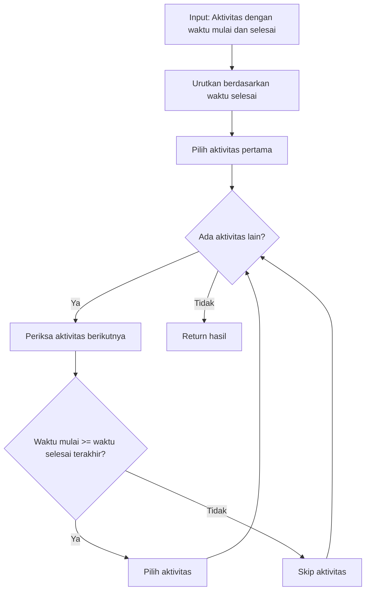

## Materi Activity Selection Problem

**Activity Selection Problem** adalah masalah optimasi klasik dalam ilmu komputer yang bertujuan untuk memilih jumlah aktivitas maksimum yang tidak saling tumpang tindih dalam waktu.

### Definisi Masalah
- Diberikan sekumpulan aktivitas dengan waktu mulai (`s`) dan waktu selesai (`f`)
- Dua aktivitas kompatibel jika tidak tumpang tindih secara waktu
- **Tujuan**: Memilih subset terbesar dari aktivitas yang semuanya kompatibel

## Algoritma Greedy untuk Activity Selection

### Strategi Pemecahan
Algoritma greedy menyelesaikan masalah ini dengan:
1. **Memilih aktivitas dengan waktu selesai paling awal** di setiap langkah
2. Memaksimalkan sisa waktu untuk aktivitas lainnya
3. Menghasilkan solusi optimal tanpa mempertimbangkan konsekuensi masa depan

### Langkah-langkah Algoritma



### Pseudocode

```
ACTIVITY-SELECTOR(s, f, n)
    A = {a1}                    // Pilih aktivitas pertama
    j = 1
    
    for i = 2 to n
        if s[i] >= f[j]         // Waktu mulai >= waktu selesai
            A = A ∪ {ai}        // Pilih aktivitas ai
            j = i               // Update aktivitas terakhir
    
    return A
```

**Keterangan**:
- `s[]`: Array waktu mulai aktivitas
- `f[]`: Array waktu selesai aktivitas (sudah diurutkan)
- `n`: Jumlah total aktivitas
- `A`: Himpunan aktivitas terpilih
- `j`: Indeks aktivitas terakhir yang dipilih

## Analisis Kompleksitas

### Kompleksitas Waktu: **O(n log n)**
- **Pengurutan aktivitas**: O(n log n)
- **Pemilihan aktivitas**: O(n)
- **Total**: O(n log n)

> Bottleneck utama adalah proses pengurutan menggunakan algoritma seperti Quick Sort atau Merge Sort.

### Kompleksitas Ruang: **O(n)**
- Menyimpan n aktivitas dalam array/vektor
- Ruang tambahan untuk hasil (worst case: O(n))
- Ruang tambahan pengurutan: O(log n) hingga O(n)

## Aplikasi dalam Dunia Nyata

| Domain | Contoh Implementasi |
|--------|-------------------|
| 🏢 **Penjadwalan & Fasilitas** | Jadwal ruang kelas, meeting, lab, olahraga |
| 💻 **Sistem Operasi** | Jadwal proses CPU, alokasi memori |
| 🚚 **Logistik** | Jadwal pengiriman & rute kendaraan |
| 📡 **Telekomunikasi** | Alokasi bandwidth & jadwal transmisi data |

## Kelebihan dan Keterbatasan

### ✅ Kekuatan
- **Sederhana** dan mudah diimplementasikan
- **Efisien** untuk dataset besar
- **Solusi optimal** untuk kasus tanpa batasan kompleks
- **Waktu eksekusi cepat** dengan kompleksitas O(n log n)

### ⚠️ Keterbatasan
- Membutuhkan **proses pengurutan awal**
- **Tidak cocok** untuk masalah dengan banyak batasan tambahan
- Tidak menangani kasus dengan **prioritas, jarak, atau biaya**
- Hanya optimal untuk **kriteria tunggal** (waktu selesai)

## Kesimpulan

Activity Selection Problem merupakan **contoh sempurna** penerapan algoritma greedy yang menghasilkan solusi optimal. Dengan mengurutkan aktivitas berdasarkan waktu selesai dan memilih aktivitas yang selesai paling awal, algoritma ini mencapai efisiensi **O(n log n)** dan cocok untuk berbagai aplikasi penjadwalan.

Untuk kasus yang lebih kompleks dengan multiple constraints, diperlukan pendekatan lain seperti:
- **Dynamic Programming**
- **Metaheuristic algorithms**
- **Integer Linear Programming**

---

> **Catatan**: Algoritma greedy tidak selalu menghasilkan solusi optimal untuk semua masalah optimasi, namun Activity Selection Problem adalah salah satu kasus khusus di mana greedy approach terbukti optimal.