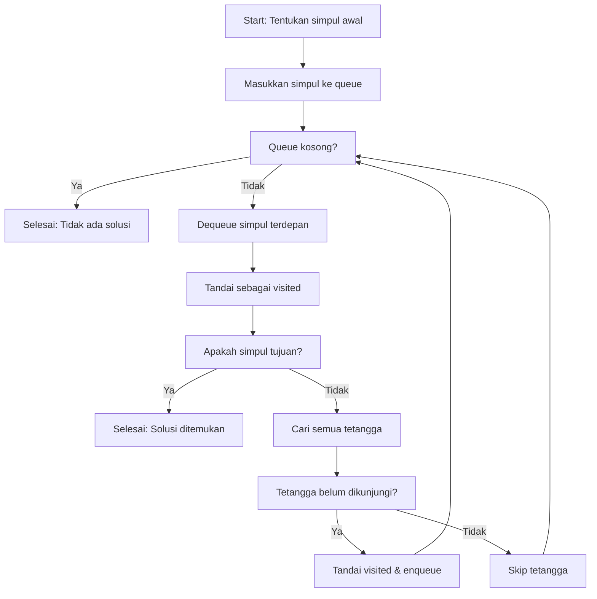

### Breadth-First Search (BFS)

## 🌊 Pengenalan

**Breadth-First Search (BFS)** adalah algoritma fundamental untuk menjelajahi graph atau tree dengan menelusuri simpul-simpul berdasarkan jaraknya dari titik awal. BFS mengeksplorasi semua simpul terdekat terlebih dahulu sebelum beralih ke simpul yang lebih jauh.

### Analogi Sederhana

> Bayangkan mencari ruang kelas di gedung kampus berlantai 3. BFS akan memeriksa **seluruh ruangan di lantai 1** terlebih dahulu, baru kemudian naik ke **lantai 2**, lalu **lantai 3**. Pendekatan ini disebut **"menjelajah secara mendatar"**.

### Karakteristik Utama

- **Strategi:** Level-by-level exploration
- **Struktur Data:** Queue (FIFO - First In First Out)
- **Pencarian:** Breadth-wise (melebar) bukan depth-wise
- **Hasil:** Jalur terpendek pada graf tak berbobot

---

## 🎯 Konsep Dasar

### Prinsip Kerja

1. **Queue-Based:** Menggunakan struktur data antrian (queue)
2. **Level-Order:** Menjelajahi simpul per lapisan/level
3. **Systematic:** Mulai dari simpul awal → kunjungi semua tetangga → lanjut ke tetangga dari tetangga

### Struktur Data Pendukung

| Komponen | Fungsi |
|----------|--------|
| **Queue** | Menyimpan simpul yang akan dikunjungi |
| **Visited Array** | Menandai simpul yang sudah dikunjungi |
| **Parent Array** | Menyimpan jalur untuk backtracking |

---

## 🔄 Algoritma BFS

### Langkah-Langkah Detil



### Pseudocode

```
BFS(graph, start, goal):
    queue = [start]
    visited = {start}
    
    while queue is not empty:
        current = queue.dequeue()
        
        if current == goal:
            return "Goal found!"
        
        for each neighbor of current:
            if neighbor not in visited:
                visited.add(neighbor)
                queue.enqueue(neighbor)
    
    return "Goal not found"
```

---

## 📊 Contoh Trace Execution

### Graf Input

```
      S (Start)
     / \
    A   B
   /   / \
  C   D   E
     /   / \
    F   G   H (Goal)
```

### Step-by-Step Execution

| Step | Queue | Simpul Aktif | Visited | Aksi |
|------|-------|--------------|---------|------|
| 1 | `[S]` | - | `{}` | Initialize dengan start node |
| 2 | `[A, B]` | S | `{S}` | Dequeue S, enqueue neighbors A, B |
| 3 | `[B, C]` | A | `{S, A}` | Dequeue A, enqueue neighbor C |
| 4 | `[C, D, E]` | B | `{S, A, B}` | Dequeue B, enqueue neighbors D, E |
| 5 | `[D, E]` | C | `{S, A, B, C}` | Dequeue C, no new neighbors |
| 6 | `[E, F]` | D | `{S, A, B, C, D}` | Dequeue D, enqueue neighbor F |
| 7 | `[F, G, H]` | E | `{S, A, B, C, D, E}` | Dequeue E, enqueue neighbors G, H |
| 8 | `[G, H]` | F | `{S, A, B, C, D, E, F}` | Dequeue F, no new neighbors |
| 9 | `[H]` | G | `{S, A, B, C, D, E, F, G}` | Dequeue G, no new neighbors |
| 10 | `[]` | H | `{S, A, B, C, D, E, F, G, H}` | **GOAL FOUND!** |

**Hasil:** Goal H ditemukan dengan jalur terpendek `S → B → E → H`

---

## 💻 Implementasi

### Implementasi C++

```cpp
#include <iostream>
#include <vector>
#include <queue>
#include <unordered_set>
#include <unordered_map>
using namespace std;

class BFS {
private:
    vector<vector<int>> adjList;
    int vertices;

public:
    BFS(int v) : vertices(v) {
        adjList.resize(v);
    }
    
    void addEdge(int u, int v) {
        adjList[u].push_back(v);
        adjList[v].push_back(u); // Undirected graph
    }
    
    bool search(int start, int goal) {
        if (start == goal) return true;
        
        queue<int> q;
        unordered_set<int> visited;
        unordered_map<int, int> parent;
        
        q.push(start);
        visited.insert(start);
        parent[start] = -1;
        
        while (!q.empty()) {
            int current = q.front();
            q.pop();
            
            cout << "Visiting: " << current << endl;
            
            // Cek semua tetangga
            for (int neighbor : adjList[current]) {
                if (visited.find(neighbor) == visited.end()) {
                    visited.insert(neighbor);
                    parent[neighbor] = current;
                    q.push(neighbor);
                    
                    // Goal ditemukan
                    if (neighbor == goal) {
                        printPath(parent, start, goal);
                        return true;
                    }
                }
            }
        }
        
        return false; // Goal tidak ditemukan
    }
    
    void printPath(unordered_map<int, int>& parent, int start, int goal) {
        vector<int> path;
        int current = goal;
        
        while (current != -1) {
            path.push_back(current);
            current = parent[current];
        }
        
        reverse(path.begin(), path.end());
        
        cout << "Shortest path: ";
        for (int i = 0; i < path.size(); i++) {
            cout << path[i];
            if (i < path.size() - 1) cout << " -> ";
        }
        cout << endl;
    }
    
    vector<int> bfsTraversal(int start) {
        vector<int> result;
        queue<int> q;
        unordered_set<int> visited;
        
        q.push(start);
        visited.insert(start);
        
        while (!q.empty()) {
            int current = q.front();
            q.pop();
            result.push_back(current);
            
            for (int neighbor : adjList[current]) {
                if (visited.find(neighbor) == visited.end()) {
                    visited.insert(neighbor);
                    q.push(neighbor);
                }
            }
        }
        
        return result;
    }
};
```

### Contoh Penggunaan

```cpp
int main() {
    BFS graph(8); // 8 vertices (0-7)
    
    // Membuat graf sesuai contoh
    graph.addEdge(0, 1); // S-A
    graph.addEdge(0, 2); // S-B  
    graph.addEdge(1, 3); // A-C
    graph.addEdge(2, 4); // B-D
    graph.addEdge(2, 5); // B-E
    graph.addEdge(4, 6); // D-F
    graph.addEdge(5, 7); // E-H (goal)
    
    cout << "BFS Search from 0 to 7:" << endl;
    bool found = graph.search(0, 7);
    
    if (found) {
        cout << "Goal found!" << endl;
    } else {
        cout << "Goal not found!" << endl;
    }
    
    cout << "\nFull BFS Traversal:" << endl;
    vector<int> traversal = graph.bfsTraversal(0);
    for (int node : traversal) {
        cout << node << " ";
    }
    cout << endl;
    
    return 0;
}
```

---

## 📈 Analisis Kompleksitas

### Kompleksitas Waktu

- **Time Complexity:** O(V + E)
  - V = Jumlah vertices (simpul)
  - E = Jumlah edges (sisi)
- **Penjelasan:** Setiap simpul dikunjungi sekali, setiap edge diperiksa sekali

### Kompleksitas Ruang

- **Space Complexity:** O(V)
- **Komponen:**
  - Queue: O(V) - worst case semua simpul di queue
  - Visited set: O(V) - menyimpan status kunjungan
  - Parent map: O(V) - untuk path reconstruction

### Perbandingan dengan DFS

| Aspek | BFS | DFS |
|-------|-----|-----|
| **Strategi** | Breadth-wise | Depth-wise |
| **Struktur Data** | Queue | Stack |
| **Memori** | O(V) | O(h) |
| **Jalur Terpendek** | ✅ Ya | ❌ Tidak |
| **Complete** | ✅ Ya | ✅ Ya |
| **Optimal** | ✅ Graf tak berbobot | ❌ Tidak |

---

## 🌍 Aplikasi di Dunia Nyata

### 1. 🗺️ Sistem Navigasi (Google Maps, Grab, Gojek)

**Use Case:** Mencari rute terpendek dari titik A ke B

```cpp
// Simplified GPS pathfinding
class GPSNavigation {
    bool findShortestRoute(Location start, Location destination) {
        // BFS untuk mencari jalur dengan paling sedikit persimpangan
        queue<Location> q;
        set<Location> visited;
        
        q.push(start);
        while (!q.empty()) {
            Location current = q.front();
            q.pop();
            
            if (current == destination) {
                return true; // Route found
            }
            
            for (Road road : current.getConnectedRoads()) {
                Location next = road.getDestination();
                if (visited.find(next) == visited.end()) {
                    visited.insert(next);
                    q.push(next);
                }
            }
        }
        return false;
    }
};
```

### 2. 🌐 Media Sosial (Facebook, LinkedIn, Instagram)

**Use Case:** Mencari "Orang yang mungkin Anda kenal"

```cpp
class SocialNetwork {
    vector<string> findMutualConnections(string userA, string userB, int maxDegree) {
        queue<pair<string, int>> q; // {user, degree}
        set<string> visited;
        vector<string> suggestions;
        
        q.push({userA, 0});
        visited.insert(userA);
        
        while (!q.empty()) {
            auto [currentUser, degree] = q.front();
            q.pop();
            
            if (degree >= maxDegree) continue;
            
            for (string friend : getFriends(currentUser)) {
                if (visited.find(friend) == visited.end()) {
                    visited.insert(friend);
                    
                    if (degree > 0 && isFriend(friend, userB)) {
                        suggestions.push_back(friend);
                    }
                    
                    q.push({friend, degree + 1});
                }
            }
        }
        
        return suggestions;
    }
};
```

### 3. 🎮 Game Development

**Use Case:** AI pathfinding dalam game seperti Pac-Man

```cpp
class GameAI {
    vector<Position> findPath(Position start, Position target, GameMap& map) {
        queue<Position> q;
        map<Position, Position> parent;
        set<Position> visited;
        
        q.push(start);
        visited.insert(start);
        parent[start] = Position(-1, -1); // Null position
        
        while (!q.empty()) {
            Position current = q.front();
            q.pop();
            
            if (current == target) {
                return reconstructPath(parent, start, target);
            }
            
            // Check 4 directions (up, down, left, right)
            for (Position neighbor : getValidMoves(current, map)) {
                if (visited.find(neighbor) == visited.end()) {
                    visited.insert(neighbor);
                    parent[neighbor] = current;
                    q.push(neighbor);
                }
            }
        }
        
        return {}; // No path found
    }
};
```

### 4. 🖥️ Jaringan Komputer

**Use Case:** Network discovery dan topology mapping

```cpp
class NetworkDiscovery {
    void discoverNetwork(string startIP) {
        queue<string> q;
        set<string> discovered;
        map<string, int> hopCount;
        
        q.push(startIP);
        discovered.insert(startIP);
        hopCount[startIP] = 0;
        
        while (!q.empty()) {
            string currentIP = q.front();
            q.pop();
            
            cout << "Device found: " << currentIP 
                 << " (Hops: " << hopCount[currentIP] << ")" << endl;
            
            // Scan for connected devices
            for (string neighborIP : scanConnectedDevices(currentIP)) {
                if (discovered.find(neighborIP) == discovered.end()) {
                    discovered.insert(neighborIP);
                    hopCount[neighborIP] = hopCount[currentIP] + 1;
                    q.push(neighborIP);
                }
            }
        }
    }
};
```

---

## ⚖️ Kelebihan dan Kekurangan

### ✅ Kelebihan

| Aspek | Deskripsi |
|-------|-----------|
| **Optimal** | Menjamin jalur terpendek pada graf tak berbobot |
| **Complete** | Selalu menemukan solusi jika ada |
| **Systematic** | Eksplorasi terstruktur level-by-level |
| **Predictable** | Kompleksitas waktu dan ruang yang dapat diprediksi |

### ❌ Kekurangan

| Aspek | Deskripsi |
|-------|-----------|
| **Memory Intensive** | Membutuhkan memori besar untuk graf luas |
| **Not Suitable for Deep Graphs** | Tidak efisien untuk graf sangat dalam |
| **No Weight Consideration** | Tidak mempertimbangkan bobot edge |
| **Exponential Space** | Space complexity bisa eksponensial pada tree |

---

## 🔄 Variasi dan Optimasi

### 1. Bidirectional BFS
Mencari dari start dan goal secara bersamaan untuk mengurangi space complexity.

```cpp
bool bidirectionalBFS(int start, int goal) {
    queue<int> qStart, qGoal;
    set<int> visitedStart, visitedGoal;
    
    qStart.push(start);
    qGoal.push(goal);
    visitedStart.insert(start);
    visitedGoal.insert(goal);
    
    while (!qStart.empty() && !qGoal.empty()) {
        // Expand from start
        if (expandLevel(qStart, visitedStart, visitedGoal)) {
            return true; // Meeting point found
        }
        
        // Expand from goal  
        if (expandLevel(qGoal, visitedGoal, visitedStart)) {
            return true; // Meeting point found
        }
    }
    
    return false;
}
```

### 2. Iterative Deepening BFS
Menggabungkan memory efficiency DFS dengan completeness BFS.

### 3. Best-First Search
Menggunakan heuristic untuk menentukan prioritas eksplorasi.

---

## 📚 Kesimpulan

**Breadth-First Search (BFS)** adalah algoritma fundamental yang powerful untuk:

### Key Points

1. **Graph Traversal:** Menjelajahi graf/tree secara level-by-level
2. **Shortest Path:** Menjamin jalur terpendek pada graf tak berbobot  
3. **Queue-Based:** Menggunakan struktur data queue (FIFO)
4. **Complete & Optimal:** Selalu menemukan solusi optimal jika ada

### Kapan Menggunakan BFS

- ✅ **Mencari jalur terpendek** tanpa mempertimbangkan bobot
- ✅ **Level-order traversal** pada tree/graf
- ✅ **Network analysis** dan social network exploration  
- ✅ **Game AI** untuk pathfinding sederhana

### Kapan Tidak Menggunakan BFS

- ❌ Graf dengan **bobot edge** (gunakan Dijkstra/A*)
- ❌ **Memory terbatas** dengan graf sangat luas
- ❌ **Deep search** lebih prioritas daripada breadth
- ❌ **Real-time application** dengan constraint ketat

> 💡 **Best Practice:** BFS excellent untuk shortest path problems pada unweighted graphs, tapi pertimbangkan Dijkstra's algorithm atau A* untuk weighted graphs.

---
