### Permasalahan N-Queens: Analisis Komprehensif Algoritma Backtracking

## 📋 Table of Contents
- [Problem Definition](#problem-definition)
- [Objectives & Importance](#objectives--importance)
- [Why Backtracking?](#why-backtracking)
- [Algorithm Analysis](#algorithm-analysis)
- [Implementation Examples](#implementation-examples)
- [Real-World Applications](#real-world-applications)
- [Conclusion](#conclusion)

---

## 🎯 Problem Definition

### What is N-Queens Problem?

The **N-Queens Problem** is a classic problem in computer science and combinatorial mathematics that involves placing **N chess queens** on an **N×N chessboard** such that **no two queens attack each other**.

### 📐 Chess Queen Movement Rules

| Direction | Description |
|-----------|-------------|
| **Horizontal** | Can move along any row |
| **Vertical** | Can move along any column |
| **Diagonal** | Can move along both diagonals |

> **🎯 Goal**: Place N queens so that no two queens share the same row, column, or diagonal.
{: .prompt-info }

### 🔥 Famous Example: 8-Queens

The most well-known variant is the **8-Queens Problem** - placing 8 queens on a standard 8×8 chessboard.

```
  a b c d e f g h
8 ♛ . . . . . . .  8
7 . . . ♛ . . . .  7
6 . . . . . ♛ . .  6
5 . . . . . . . ♛  5
4 . ♛ . . . . . .  4
3 . . . . ♛ . . .  3
2 . . ♛ . . . . .  2
1 . . . . . . ♛ .  1
  a b c d e f g h
```

---

## 🎯 Objectives & Importance

### Primary Objectives

1. **🔍 Find Valid Configurations**
   - Discover all possible queen placements that satisfy the non-attacking constraint

2. **⚙️ Algorithm Development**
   - Test and develop search algorithms: backtracking, DFS, heuristic search
   - Implement genetic algorithms and other optimization techniques

3. **🧠 Logic Training**
   - Practice problem-solving in the context of Constraint Satisfaction Problems (CSP)

### 💡 Why is N-Queens Important?

#### 1. **AI & Algorithm Case Study**
- **Educational Tool**: Teaches search techniques like backtracking and branch-and-bound
- **Foundation**: Core concept in artificial intelligence and operations research
- **Benchmark**: Standard problem for algorithm comparison

#### 2. **Constraint Satisfaction Model**
- **Perfect CSP Example**: Assign values (queen positions) to variables (rows/columns)
- **Constraint Handling**: Without violating rules (no attacks between queens)
- **Optimization**: Efficient constraint propagation techniques

#### 3. **Real-World Applications**

| Domain | Application | Description |
|--------|-------------|-------------|
| **Scheduling** | Task Assignment | Avoid resource conflicts |
| **Electronics** | Circuit Layout | Component placement optimization |
| **Resources** | Allocation | Mutually exclusive resource distribution |
| **Planning** | Route Optimization | Conflict-free path planning |

#### 4. **Complexity & Scalability**


> **⚠️ Complexity**: Time complexity grows exponentially with increasing N, making it perfect for algorithm efficiency evaluation.
{: .prompt-warning }

---

## 🔄 Why Backtracking?

### 🔧 Three Key Characteristics

#### 1. **Recursive & Incremental Approach**
```
Start with empty board
↓
Place queen in row 1, column 1
↓
Check if position is safe
↓
If safe → Continue to next row
If not safe → Try next column
↓
If no valid column → BACKTRACK to previous row
```

#### 2. **Search Tree Structure**
- **Nodes**: Each queen placement represents a tree node
- **Paths**: Root-to-leaf paths represent potential solutions
- **Pruning**: Invalid paths are eliminated early (optimization)

#### 3. **Non-deterministic Nature**
- **Multiple Possibilities**: Many potential positions for each queen
- **Unknown Solution**: Correct positions not known in advance
- **Systematic Exploration**: Must try all possibilities methodically

### 📊 Backtracking vs Brute Force

| Approach | Time Complexity | Space Complexity | Pruning |
|----------|----------------|------------------|---------|
| **Brute Force** | O(N^N) | O(1) | ❌ None |
| **Backtracking** | O(N!) | O(N) | ✅ Early termination |

---

## ⚙️ Algorithm Analysis

### 🔍 What is Backtracking?

> **Backtracking** is a systematic problem-solving technique that builds solutions incrementally and "backtracks" when encountering dead ends. It's an optimized brute-force approach that eliminates invalid solutions as early as possible.
{: .prompt-tip }

### 🔄 Backtracking Algorithm Steps

```mermaid
flowchart TD
    A[🎯 Start: Choose Decision] --> B[🔍 Constraint Check]
    B --> C{✅ Valid Choice?}
    C -->|✅ Yes| D[🔄 Recursive Exploration]
    C -->|❌ No| E[⬅️ Backtrack: Try Next Option]
    D --> F{🏁 Complete Solution?}
    F -->|✅ Yes| G[📝 Record Solution]
    F -->|❌ No| A
    E --> H{More Options?}
    H -->|✅ Yes| A
    H -->|❌ No| I[⬆️ Backtrack to Previous Level]
    G --> J[🔄 Continue Search or End]
```



### 📋 Detailed Algorithm Steps

#### **Step 1: Decision Choice** 🎯
```cpp
// Example: Choose column for queen in current row
for (int col = 0; col < N; col++) {
    // Try placing queen at (row, col)
}
```

#### **Step 2: Constraint Check** 🔍
```cpp
bool isSafe(int board[][], int row, int col) {
    // Check row, column, and diagonals
    // Return true if position is safe
}
```

#### **Step 3: Recursive Exploration** 🔄
```cpp
if (isSafe(board, row, col)) {
    board[row][col] = 1;  // Place queen
    if (solveNQueens(board, row + 1)) {
        return true;  // Solution found
    }
    board[row][col] = 0;  // Backtrack
}
```

#### **Step 4: Backtrack** ⬅️
```cpp
// If current path leads to dead end
board[row][col] = 0;  // Remove queen
// Try next possibility
```

#### **Step 5: Base Case** 🏁
```cpp
if (row >= N) {
    // All queens placed successfully
    printSolution(board);
    return true;
}
```

---

## 💻 Implementation Examples

### 🔢 Example 1: Array Permutation

**Problem**: Find all permutations of `[1, 2, 3]`

```cpp
void findPermutations(vector<int>& nums, vector<int>& current, vector<bool>& used, vector<vector<int>>& result) {
    // Base case: complete permutation
    if (current.size() == nums.size()) {
        result.push_back(current);
        return;
    }
    
    // Try each unused number
    for (int i = 0; i < nums.size(); i++) {
        if (!used[i]) {
            // Choose
            current.push_back(nums[i]);
            used[i] = true;
            
            // Explore
            findPermutations(nums, current, used, result);
            
            // Backtrack
            current.pop_back();
            used[i] = false;
        }
    }
}
```

**Execution Tree**:
```
                    []
           /         |         \
        [1]         [2]        [3]
       /   \       /   \      /   \
    [1,2] [1,3]  [2,1] [2,3] [3,1] [3,2]
      |     |      |     |     |     |
   [1,2,3][1,3,2][2,1,3][2,3,1][3,1,2][3,2,1]
```

**Result**: `[[1,2,3], [1,3,2], [2,1,3], [2,3,1], [3,1,2], [3,2,1]]`

### 👔 Example 2: Employee Office Assignment

**Scenario**: Place **n employees** in **n office rooms** with constraints:

#### 📋 Rules & Constraints

| Rule | Description |
|------|-------------|
| **Adjacent Rooms** | No two employees in neighboring rooms |
| **Sight Lines** | No employees in direct line of sight |
| **Resource Sharing** | No conflicting resource requirements |

#### 🔄 Assignment Process

```mermaid
graph TD
    A[👤 Employee 1] --> B[🏢 Room 1: Available]
    B --> C[👤 Employee 2] 
    C --> D{🔍 Check Constraints}
    D -->|✅ Valid| E[🏢 Assign Room 2]
    D -->|❌ Invalid| F[⬅️ Try Next Room]
    E --> G[👤 Employee 3]
    F --> G
    G --> H{🔍 Any Valid Room?}
    H -->|✅ Yes| I[✅ Assign Room]
    H -->|❌ No| J[⬅️ BACKTRACK: Reassign Previous Employee]
```



#### 💡 Backtracking Scenario

```
Initial State: [Employee1: Room1, Employee2: Room3, Employee3: ?]
                              ↓
Problem: No valid room for Employee 3 due to constraints
                              ↓
Backtrack: Try Employee2 in different room
                              ↓
New State: [Employee1: Room1, Employee2: Room4, Employee3: Room2]
                              ↓
Success: All employees assigned!
```

#### 🌍 Real-World Applications

| Domain | Example | Constraints |
|--------|---------|-------------|
| **Office Planning** | Workstation assignment | Noise levels, team proximity |
| **Hospital** | Patient room allocation | Medical equipment, isolation needs |
| **Classroom** | Student seating | Behavior management, accessibility |
| **Parking** | Vehicle assignment | Size restrictions, accessibility |

---

## 🎓 Relevance in Design and Analysis of Algorithms (DAA)

### 📚 Educational Value

#### 1. **Backtracking Case Study**
- **Systematic Learning**: Illustrates backtracking concepts step-by-step
- **Pattern Recognition**: Students learn to identify backtracking scenarios
- **Implementation Practice**: Hands-on coding experience

#### 2. **Algorithm Complexity Analysis**

| Metric | Brute Force | Backtracking | Optimized Backtracking |
|--------|-------------|--------------|----------------------|
| **Time Complexity** | O(N^N) | O(N!) | O(N!) with pruning |
| **Space Complexity** | O(1) | O(N) | O(N) |
| **Practical Performance** | Very Poor | Better | Much Better |

#### 3. **Advanced CSP Concepts**


- **Forward Checking**: Eliminate future possibilities early
- **Backjumping**: Skip irrelevant backtrack levels
- **Arc Consistency**: Maintain constraint consistency

---

## 🚀 Advanced Optimizations

### 🎯 Heuristics for N-Queens

#### 1. **Most Constrained Variable (MCV)**
```cpp
// Choose row/column with fewest valid options
int chooseMostConstrainedPosition(board) {
    int minOptions = N;
    int bestPosition = -1;
    
    for (int pos = 0; pos < N; pos++) {
        int options = countValidOptions(board, pos);
        if (options < minOptions) {
            minOptions = options;
            bestPosition = pos;
        }
    }
    return bestPosition;
}
```

#### 2. **Least Constraining Value (LCV)**
```cpp
// Choose value that eliminates fewest future options
vector<int> orderValuesByConstraint(board, position) {
    vector<pair<int, int>> valueConstraints;
    
    for (int value : possibleValues) {
        int constraintCount = countFutureConstraints(board, position, value);
        valueConstraints.push_back({constraintCount, value});
    }
    
    sort(valueConstraints.begin(), valueConstraints.end());
    // Return values in ascending order of constraints
}
```

### 📊 Performance Comparison

| N | Brute Force | Basic Backtracking | Optimized Backtracking |
|---|-------------|-------------------|----------------------|
| 4 | 256 states | ~20 states | ~10 states |
| 8 | 16.7M states | ~2,000 states | ~200 states |
| 12 | 8.9B states | ~50,000 states | ~1,000 states |

---

## 🔬 Algorithm Complexity Deep Dive

### ⏱️ Time Complexity Analysis

#### Worst Case: O(N!)
```
Level 1: N choices for first queen
Level 2: (N-1) choices for second queen  
Level 3: (N-2) choices for third queen
...
Total: N × (N-1) × (N-2) × ... × 1 = N!
```

#### Average Case: Much Better
- **Early Pruning**: Invalid branches eliminated quickly
- **Constraint Propagation**: Reduces search space significantly
- **Heuristics**: Smart choice ordering improves performance

### 💾 Space Complexity: O(N)

```cpp
// Space requirements:
int board[N][N];           // O(N²) for board representation
int recursionStack[N];     // O(N) for recursion depth
bool columnUsed[N];        // O(N) for column tracking
bool diagonal1[2*N-1];     // O(N) for diagonal tracking
bool diagonal2[2*N-1];     // O(N) for diagonal tracking

// Total: O(N²) but can be optimized to O(N)
```

---

## 🌟 Conclusion

### 🎯 Key Takeaways

1. **Problem-Solving Paradigm**
   - N-Queens exemplifies systematic constraint satisfaction
   - Demonstrates power of backtracking in complex search spaces

2. **Algorithm Design Principles**
   - **Incremental Construction**: Build solutions step by step
   - **Early Termination**: Eliminate invalid paths quickly
   - **State Management**: Efficient undo operations

3. **Practical Applications**
   - **Scheduling Systems**: Resource allocation without conflicts
   - **Layout Problems**: Optimal placement with constraints
   - **AI Planning**: Goal achievement with obstacle avoidance

### 🚀 Future Directions

| Approach | Description | Benefits |
|----------|-------------|----------|
| **Parallel Processing** | Distribute search across multiple cores | Significant speedup |
| **Machine Learning** | Learn optimal heuristics from data | Better pruning strategies |
| **Quantum Computing** | Quantum search algorithms | Exponential speedup potential |

### 📈 Performance Summary

> **Backtracking** transforms an intractable brute-force problem into a manageable search challenge through:
> - **Systematic exploration** with intelligent pruning
> - **Constraint propagation** for early failure detection  
> - **Recursive structure** enabling elegant implementation
> - **Scalable optimization** through heuristic enhancement
{: .prompt-success }

---

