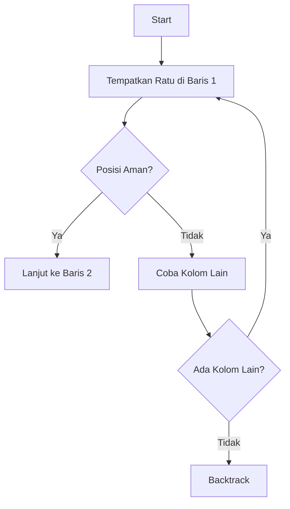

# 👑 N-Queens Problem: Penerapan Algoritma Backtracking

### 📚 Design and Analysis of Algorithms


## 📑 **Daftar Isi**

1. [🔍 Definisi Masalah N-Queens](#-definisi-masalah-n-queens)
2. [🎯 Tujuan Masalah N-Queens](#-tujuan-masalah-n-queens)
3. [⚡ Pentingnya Masalah N-Queens](#-pentingnya-masalah-n-queens)
4. [🔄 Mengapa N-Queens Masalah Backtracking](#-mengapa-n-queens-masalah-backtracking)
5. [📐 Algoritma Backtracking](#-algoritma-backtracking)
6. [💼 Studi Kasus: Penempatan Karyawan](#-studi-kasus-penempatan-karyawan)
7. [💻 Implementasi Kode C++](#-implementasi-kode-c)
8. [📊 Analisis Kompleksitas](#-analisis-kompleksitas)
9. [🎓 Kesimpulan](#-kesimpulan)

---

## 🔍 **Definisi Masalah N-Queens**

> **N-Queens Problem** adalah sebuah permasalahan klasik dalam bidang ilmu komputer dan matematika kombinatorik yang melibatkan penempatan N buah ratu catur pada sebuah papan catur berukuran N × N.

### 📋 **Aturan Penempatan:**

- ✅ **Tidak ada dua ratu** yang saling menyerang
- ✅ **Setiap ratu** harus berada di posisi yang aman
- ✅ **Ratu dapat bergerak:**
  - ➡️ Horizontal (baris)
  - ⬇️ Vertikal (kolom)  
  - ↗️ Diagonal

### 🎲 **Contoh Klasik: 8-Queens**

```
♛ · · · · · · ·
· · · · ♛ · · ·
· · · · · · · ♛
· · · · · ♛ · ·
· · ♛ · · · · ·
· · · · · · ♛ ·
· ♛ · · · · · ·
· · · ♛ · · · ·
```

---

## 🎯 **Tujuan Masalah N-Queens**

### 1️⃣ **Pencarian Solusi**
- 🔎 Menemukan semua konfigurasi penempatan ratu yang valid
- 📊 Menghitung jumlah solusi yang mungkin untuk nilai N tertentu

### 2️⃣ **Pengembangan Algoritma**
- 🧪 Menguji algoritma pencarian dan optimasi:
  - 🔄 Backtracking
  - 🌳 Depth-First Search (DFS)
  - 🧬 Algoritma Genetika
  - 🎯 Heuristic Search

### 3️⃣ **Pembelajaran Pemrograman**
- 💡 Melatih logika pemrograman
- 🧩 Memahami Constraint Satisfaction Problem (CSP)
- 📈 Analisis kompleksitas algoritma

---

## ⚡ **Pentingnya Masalah N-Queens**

### 🎓 **1. Studi Kasus dalam AI dan Algoritma**

N-Queens menjadi **landasan fundamental** dalam pembelajaran:
- 🤖 Artificial Intelligence
- 📊 Operations Research
- 🧮 Teknik pencarian algoritma

### 🧩 **2. Model Permasalahan Constraint Satisfaction**

**CSP (Constraint Satisfaction Problem)** di mana:
- 📍 **Variabel**: Posisi ratu (baris/kolom)
- 🎯 **Domain**: Semua posisi yang mungkin
- 🚫 **Constraints**: Tidak ada ratu yang saling serang

### 🌍 **3. Aplikasi dalam Dunia Nyata**

| Aplikasi | Deskripsi |
|:---------|:----------|
| 📅 **Penjadwalan** | Mengatur jadwal tanpa konflik waktu |
| 🔌 **Sirkuit Elektronik** | Penempatan modul tanpa interferensi |
| 💼 **Alokasi Sumber Daya** | Distribusi resource yang eksklusif |
| 🏢 **Tata Ruang** | Pengaturan layout yang optimal |

### 📈 **4. Kompleksitas dan Skalabilitas**

- ⏱️ Kompleksitas meningkat **eksponensial** dengan N
- 🔬 Evaluasi efisiensi algoritma skala besar
- 💪 Benchmark performa komputasi

---

## 🔄 **Mengapa N-Queens Masalah Backtracking**

### 🎯 **1. Pendekatan Rekursif dan Bertahap**



### 🌳 **2. Pohon Pencarian Solusi**

- 🌱 **Root**: State awal (papan kosong)
- 🌿 **Node**: State dengan beberapa ratu
- 🍃 **Leaf**: Solusi lengkap atau dead-end
- ✂️ **Pruning**: Pemangkasan jalur invalid

### 🎲 **3. Sifat Non-deterministik**

- ❓ Tidak diketahui posisi optimal sejak awal
- 🔍 Perlu eksplorasi sistematis
- ⚡ Backtracking = Brute-force yang dioptimasi

---

## 📐 **Algoritma Backtracking**

> **Backtracking** adalah teknik penyelesaian masalah yang membangun solusi langkah demi langkah dan "mundur" ketika menemui jalan buntu.

### 📝 **Langkah-langkah Algoritma:**

#### 1️⃣ **Pilih Keputusan (Decision Choice)**
```python
# Pilih kolom untuk ratu di baris berikutnya
for col in range(N):
    if is_safe(board, row, col):
        place_queen(board, row, col)
```

#### 2️⃣ **Batasan (Constraint Check)**
```python
def is_safe(board, row, col):
    # Cek vertikal, horizontal, diagonal
    return check_column(col) and check_diagonals(row, col)
```

#### 3️⃣ **Rekursi (Recursive Exploration)**
```python
if solve_n_queens(board, row + 1):
    return True  # Solusi ditemukan
```

#### 4️⃣ **Backtrack (Kembali jika Dead End)**
```python
remove_queen(board, row, col)  # Undo
# Coba posisi lain
```

#### 5️⃣ **Basis Kasus (Base Case)**
```python
if row == N:
    return True  # Semua ratu sudah ditempatkan
```

### 🔢 **Contoh: Permutasi [1, 2, 3]**

```
                    []
          /         |         \
        [1]        [2]        [3]
       /   \      /   \      /   \
    [1,2] [1,3] [2,1] [2,3] [3,1] [3,2]
     |     |     |     |     |     |
  [1,2,3][1,3,2][2,1,3][2,3,1][3,1,2][3,2,1]
```

**Hasil**: `[[1,2,3], [1,3,2], [2,1,3], [2,3,1], [3,1,2], [3,2,1]]`

---

## 💼 **Studi Kasus: Penempatan Karyawan**

### 🏢 **Skenario:**
Sebuah perusahaan memiliki **n karyawan** dan **n ruang kerja**.

### 📋 **Aturan Penempatan:**

1. 🚫 **Ruang berdekatan** tidak boleh digunakan bersamaan
2. 🚫 **Karyawan tidak boleh** dalam garis lurus yang sama
3. ✅ **Setiap karyawan** harus memiliki ruang terpisah

### 🔄 **Proses Backtracking:**

```
Langkah 1: Karyawan A → Ruang 1 ✅
Langkah 2: Karyawan B → Ruang 3 ✅ (skip Ruang 2)
Langkah 3: Karyawan C → Ruang 5 ✅
Langkah 4: Karyawan D → ❌ Tidak ada ruang valid
           BACKTRACK → Ubah posisi Karyawan C
```

### 🌍 **Aplikasi Dunia Nyata:**

- 🪑 Pengaturan tempat duduk
- 🏭 Alokasi ruang produksi
- 📡 Penempatan antenna tanpa interferensi
- 🖥️ Distribusi server dalam data center

---

## 💻 **Implementasi Kode C++**

### 📝 **Struktur Dasar:**

```cpp
#include <iostream>
#include <vector>
using namespace std;

class NQueens {
private:
    int n;
    vector<vector<int>> board;
    vector<vector<int>> solutions;
    
public:
    NQueens(int size) : n(size), board(size, vector<int>(size, 0)) {}
    
    // 🔍 Fungsi untuk mengecek keamanan posisi
    bool isSafe(int row, int col) {
        // Cek kolom
        for (int i = 0; i < row; i++) {
            if (board[i][col] == 1) return false;
        }
        
        // Cek diagonal kiri atas
        for (int i = row, j = col; i >= 0 && j >= 0; i--, j--) {
            if (board[i][j] == 1) return false;
        }
        
        // Cek diagonal kanan atas
        for (int i = row, j = col; i >= 0 && j < n; i--, j++) {
            if (board[i][j] == 1) return false;
        }
        
        return true;
    }
    
    // 🔄 Fungsi backtracking utama
    bool solveNQueens(int row = 0) {
        // Base case: semua ratu sudah ditempatkan
        if (row >= n) {
            saveSolution();
            return true;
        }
        
        bool foundSolution = false;
        
        // Coba setiap kolom di baris ini
        for (int col = 0; col < n; col++) {
            if (isSafe(row, col)) {
                // Tempatkan ratu
                board[row][col] = 1;
                
                // Rekursi untuk baris berikutnya
                if (solveNQueens(row + 1)) {
                    foundSolution = true;
                }
                
                // Backtrack: hapus ratu
                board[row][col] = 0;
            }
        }
        
        return foundSolution;
    }
    
    // 💾 Simpan solusi
    void saveSolution() {
        vector<int> solution;
        for (int i = 0; i < n; i++) {
            for (int j = 0; j < n; j++) {
                if (board[i][j] == 1) {
                    solution.push_back(j);
                    break;
                }
            }
        }
        solutions.push_back(solution);
    }
    
    // 📊 Tampilkan papan
    void displayBoard() {
        for (int i = 0; i < n; i++) {
            for (int j = 0; j < n; j++) {
                cout << (board[i][j] ? "♛ " : "· ");
            }
            cout << endl;
        }
        cout << endl;
    }
};

// 🚀 Main function
int main() {
    int n = 8;
    NQueens nQueens(n);
    
    cout << "🎯 Solving " << n << "-Queens Problem..." << endl;
    cout << "================================" << endl;
    
    if (nQueens.solveNQueens()) {
        cout << "✅ Found " << nQueens.getTotalSolutions() 
             << " solutions!" << endl;
        nQueens.displayFirstSolution();
    } else {
        cout << "❌ No solution exists!" << endl;
    }
    
    return 0;
}
```

---

## 📊 **Analisis Kompleksitas**

### ⏱️ **Kompleksitas Waktu:**

| Algoritma | Best Case | Average Case | Worst Case |
|:----------|:----------|:-------------|:-----------|
| Brute Force | O(N^N) | O(N^N) | O(N^N) |
| Backtracking | O(N!) | O(N!) | O(N!) |
| Optimized BT | O(N!) | O(N!/2) | O(N!) |

### 💾 **Kompleksitas Ruang:**

- 📦 **Stack Space**: O(N) untuk rekursi
- 🗂️ **Board Storage**: O(N²)
- 📊 **Total**: O(N²)

### 📈 **Performa berdasarkan N:**

| N | Jumlah Solusi | Waktu (Backtracking) |
|:--|:--------------|:---------------------|
| 4 | 2 | ~0.001s |
| 8 | 92 | ~0.01s |
| 12 | 14,200 | ~1s |
| 15 | 2,279,184 | ~1 menit |
| 20 | 39,029,188,884 | ~1 jam |

---

## 🎓 **Kesimpulan**

### ✨ **Key Takeaways:**

1. **🔄 Backtracking** adalah teknik powerful untuk CSP
2. **👑 N-Queens** adalah benchmark klasik algoritma
3. **📚 Relevansi tinggi** dalam pembelajaran DAA
4. **🌍 Aplikasi luas** dalam dunia nyata
5. **⚡ Optimasi penting** untuk skala besar

### 🚀 **Pengembangan Lebih Lanjut:**

- 🧬 **Algoritma Genetika** untuk N besar
- 🎯 **Heuristic** untuk percepatan
- 🖥️ **Paralelisasi** untuk performa
- 🤖 **Machine Learning** untuk prediksi solusi

