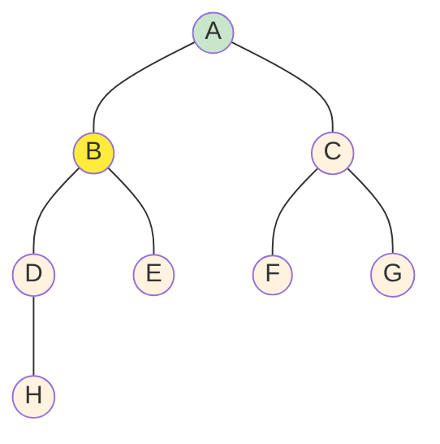
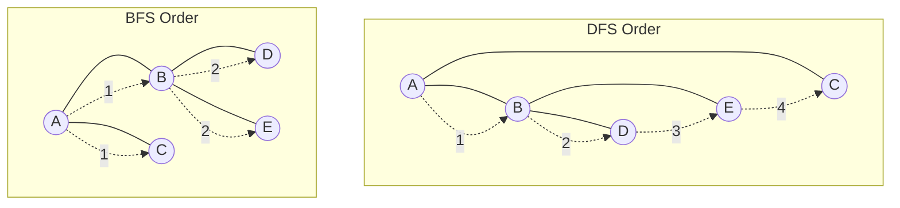

# Depth First Search: Algoritma Pencarian Graf Mendalam

## 📋 Daftar Isi
- [Pengertian](#pengertian)
- [Cara Kerja](#cara-kerja)
- [Implementasi](#implementasi)
- [Aplikasi Praktis](#aplikasi-praktis)
- [Analisis Algoritma](#analisis-algoritma)
- [Perbandingan dengan BFS](#perbandingan-dengan-bfs)
- [Kesimpulan](#kesimpulan)

---

## 🎯 Pengertian {#pengertian}

**Depth First Search (DFS)** adalah algoritma traversal graf yang mengeksplorasi setiap cabang secara mendalam sebelum backtrack ke cabang lainnya. DFS menggunakan prinsip **Last In First Out (LIFO)** dengan struktur data **stack**.

> **Prinsip Utama**: "Jelajahi sedalam mungkin sebelum mundur"
> 
> **Struktur Data**: Stack (eksplisit atau implisit melalui rekursi)
> 
> **Strategi**: Depth-first exploration
{: .prompt-info }

### Karakteristik Utama

| Aspek | Deskripsi |
|-------|-----------|
| **Traversal Order** | Mendalam dulu, lebar kemudian |
| **Memory Usage** | O(h) dimana h = tinggi maksimum |
| **Implementation** | Rekursi atau Stack eksplisit |
| **Path Finding** | Tidak menjamin jalur terpendek |

---

## ⚙️ Cara Kerja {#cara-kerja}

### Prinsip Kerja DFS

```
1. MULAI dari simpul awal
2. TANDAI simpul sebagai dikunjungi
3. KUNJUNGI semua tetangga yang belum dikunjungi
4. REKURSI ke tetangga (depth-first)
5. BACKTRACK jika tidak ada tetangga yang belum dikunjungi
6. ULANGI sampai semua simpul terjelajahi
```

### Algoritma DFS (Rekursif)

```python
function DFS(graph, vertex, visited):
    // Tandai vertex sebagai dikunjungi
    visited[vertex] = true
    print(vertex)  // Proses vertex
    
    // Rekursi untuk semua tetangga yang belum dikunjungi
    for each neighbor in graph[vertex]:
        if not visited[neighbor]:
            DFS(graph, neighbor, visited)
```

### Algoritma DFS (Iteratif dengan Stack)

```python
function DFS_Iterative(graph, start):
    visited = set()
    stack = [start]
    
    while stack is not empty:
        vertex = stack.pop()
        
        if vertex not in visited:
            visited.add(vertex)
            print(vertex)  // Proses vertex
            
            // Tambahkan semua tetangga ke stack
            for neighbor in graph[vertex]:
                if neighbor not in visited:
                    stack.push(neighbor)
```

### Visualisasi Langkah DFS



---

## 💻 Implementasi {#implementasi}

### 1. Implementasi Rekursif (Python)

```python
class DFSGraph:
    def __init__(self):
        self.graph = {}
    
    def add_edge(self, u, v):
        if u not in self.graph:
            self.graph[u] = []
        if v not in self.graph:
            self.graph[v] = []
        self.graph[u].append(v)
        self.graph[v].append(u)  # Untuk graf tidak berarah
    
    def dfs_recursive(self, start, visited=None):
        if visited is None:
            visited = set()
        
        visited.add(start)
        print(f"Mengunjungi: {start}")
        
        for neighbor in self.graph.get(start, []):
            if neighbor not in visited:
                self.dfs_recursive(neighbor, visited)
        
        return visited

# Contoh penggunaan
g = DFSGraph()
g.add_edge('A', 'B')
g.add_edge('A', 'C')
g.add_edge('B', 'D')
g.add_edge('B', 'E')
g.add_edge('C', 'F')

print("DFS Traversal:")
g.dfs_recursive('A')
```

### 2. Implementasi Iteratif (Java)

```java
import java.util.*;

public class DFS {
    private Map<Character, List<Character>> graph;
    
    public DFS() {
        graph = new HashMap<>();
    }
    
    public void addEdge(char u, char v) {
        graph.computeIfAbsent(u, k -> new ArrayList<>()).add(v);
        graph.computeIfAbsent(v, k -> new ArrayList<>()).add(u);
    }
    
    public void dfsIterative(char start) {
        Set<Character> visited = new HashSet<>();
        Stack<Character> stack = new Stack<>();
        
        stack.push(start);
        
        while (!stack.isEmpty()) {
            char current = stack.pop();
            
            if (!visited.contains(current)) {
                visited.add(current);
                System.out.println("Mengunjungi: " + current);
                
                // Tambahkan tetangga ke stack
                List<Character> neighbors = graph.get(current);
                if (neighbors != null) {
                    for (char neighbor : neighbors) {
                        if (!visited.contains(neighbor)) {
                            stack.push(neighbor);
                        }
                    }
                }
            }
        }
    }
}
```

### 3. Aplikasi DFS: Deteksi Cycle

```python
def has_cycle_dfs(graph, start, visited, rec_stack):
    visited[start] = True
    rec_stack[start] = True
    
    for neighbor in graph[start]:
        if not visited[neighbor]:
            if has_cycle_dfs(graph, neighbor, visited, rec_stack):
                return True
        elif rec_stack[neighbor]:
            return True  # Cycle detected
    
    rec_stack[start] = False
    return False

def detect_cycle(graph):
    visited = {node: False for node in graph}
    rec_stack = {node: False for node in graph}
    
    for node in graph:
        if not visited[node]:
            if has_cycle_dfs(graph, node, visited, rec_stack):
                return True
    return False
```

---

## 🌍 Aplikasi Praktis {#aplikasi-praktis}

### 1. 🔍 Pencarian Path dalam Maze

```
Skenario: Robot navigasi dalam labirin
├── Representasi: Grid 2D sebagai graf
├── DFS: Eksplorasi jalur sampai menemukan exit
├── Backtrack: Kembali jika menemui dead-end
└── Hasil: Path dari start ke finish (tidak selalu optimal)
```

### 2. 🌐 Web Crawling

```
Skenario: Search engine mengindeks website
├── Start: URL seed
├── DFS: Follow links secara mendalam
├── Visited: Track halaman yang sudah dikunjungi
└── Depth Limit: Batasi kedalaman crawling
```

### 3. 🧩 Topological Sorting

```
Skenario: Penjadwalan tugas dengan dependensi
├── Nodes: Tasks/courses
├── Edges: Dependencies
├── DFS: Post-order traversal
└── Result: Valid execution order
```

### 4. 🔗 Connected Components

```
Skenario: Analisis jaringan sosial
├── Nodes: Users
├── Edges: Friendships
├── DFS: Find all connected users
└── Result: Separate social groups
```

### 5. 🎯 Game AI (Decision Trees)

```
Skenario: AI dalam game strategy
├── Nodes: Game states
├── Edges: Possible moves
├── DFS: Explore game tree deeply
└── Evaluation: Minimax algorithm
```

---

## 📊 Analisis Algoritma {#analisis-algoritma}

### Kompleksitas

| Aspek | Adjacency List | Adjacency Matrix |
|-------|----------------|------------------|
| **Time Complexity** | O(V + E) | O(V²) |
| **Space Complexity** | O(V) | O(V) |
| **Recursive Stack** | O(h) | O(h) |

> **V** = Jumlah vertices (simpul)
> 
> **E** = Jumlah edges (sisi)
> 
> **h** = Tinggi maksimum graf (longest path)
{: .prompt-info }

### 🟢 Kelebihan

| No | Kelebihan | Penjelasan |
|----|-----------|------------|
| **1** | **Memory Efficient** | Hanya perlu O(h) space untuk stack |
| **2** | **Path Detection** | Bagus untuk menemukan path (tidak harus optimal) |
| **3** | **Cycle Detection** | Efektif untuk mendeteksi cycle dalam graf |
| **4** | **Topological Sort** | Essential untuk dependency resolution |
| **5** | **Simple Implementation** | Mudah diimplementasi dengan rekursi |
| **6** | **Backtracking Support** | Natural untuk algoritma backtracking |

### 🔴 Kekurangan

| No | Kekurangan | Impact |
|----|------------|--------|
| **1** | **Tidak Optimal** | Tidak menjamin shortest path |
| **2** | **Stack Overflow** | Rekursi dalam pada graf dalam |
| **3** | **Tidak Systematic** | Urutan kunjungan tidak predictable |
| **4** | **Infinite Loop Risk** | Pada graf dengan cycle (tanpa visited check) |

---

## ⚖️ Perbandingan dengan BFS {#perbandingan-dengan-bfs}

| Aspek | DFS | BFS |
|-------|-----|-----|
| **Struktur Data** | Stack (LIFO) | Queue (FIFO) |
| **Traversal** | Depth-first | Breadth-first |
| **Memory** | O(h) | O(w) |
| **Shortest Path** | ❌ Tidak menjamin | ✅ Menjamin untuk unweighted |
| **Implementation** | Rekursi/Stack | Queue |
| **Use Case** | Path finding, Cycle detection | Shortest path, Level-order |

### Visualisasi Perbandingan



---

## 🔄 Variasi DFS

### 1. DFS dengan Timestamps

```python
def dfs_with_timestamps(graph, start):
    time = [0]  # Mutable counter
    discovery = {}
    finish = {}
    visited = set()
    
    def dfs_visit(vertex):
        time[0] += 1
        discovery[vertex] = time[0]
        visited.add(vertex)
        
        for neighbor in graph[vertex]:
            if neighbor not in visited:
                dfs_visit(neighbor)
        
        time[0] += 1
        finish[vertex] = time[0]
    
    dfs_visit(start)
    return discovery, finish
```

### 2. DFS untuk Strongly Connected Components

```python
def kosaraju_scc(graph):
    # Step 1: DFS pada graf original untuk mendapat finish times
    visited = set()
    finish_order = []
    
    def dfs1(vertex):
        visited.add(vertex)
        for neighbor in graph[vertex]:
            if neighbor not in visited:
                dfs1(neighbor)
        finish_order.append(vertex)
    
    # Step 2: DFS pada transpose graf
    def dfs2(vertex, component):
        visited.add(vertex)
        component.append(vertex)
        for neighbor in transpose_graph[vertex]:
            if neighbor not in visited:
                dfs2(neighbor, component)
    
    # Implementation continues...
```

---

## 🎯 Best Practices

### ✅ Do's

- **Gunakan iterative** untuk graf yang sangat dalam
- **Track visited nodes** untuk menghindari infinite loop
- **Implement depth limit** untuk menghindari stack overflow
- **Choose appropriate data structure** untuk adjacency representation

### ❌ Don'ts

- **Jangan andalkan untuk shortest path** tanpa modification
- **Jangan gunakan rekursi** untuk graf dengan kedalaman > 1000
- **Jangan lupa handle disconnected components**
- **Jangan abaikan cycle detection** dalam directed graphs

---

## 💡 Tips Optimasi

### 1. Memory Optimization

```python
# Gunakan generator untuk large graphs
def dfs_generator(graph, start):
    visited = set()
    stack = [start]
    
    while stack:
        vertex = stack.pop()
        if vertex not in visited:
            visited.add(vertex)
            yield vertex  # Generator
            
            for neighbor in reversed(graph[vertex]):
                if neighbor not in visited:
                    stack.append(neighbor)
```

### 2. Early Termination

```python
def dfs_find_target(graph, start, target):
    visited = set()
    stack = [start]
    
    while stack:
        vertex = stack.pop()
        if vertex == target:
            return True  # Early termination
            
        if vertex not in visited:
            visited.add(vertex)
            for neighbor in graph[vertex]:
                if neighbor not in visited:
                    stack.append(neighbor)
    
    return False
```

---

## 🎯 Kesimpulan {#kesimpulan}

Depth First Search adalah algoritma fundamental dalam computer science yang sangat versatile untuk berbagai masalah graf. Dengan pendekatan "depth-first", DFS memberikan solusi elegant untuk masalah seperti path finding, cycle detection, dan topological sorting.

### Key Takeaways

- **Depth-First Strategy**: Eksplorasi mendalam sebelum melebar
- **Stack-Based**: Menggunakan LIFO principle (rekursi atau stack eksplisit)
- **Memory Efficient**: O(h) space complexity
- **Versatile Applications**: Dari maze solving hingga compiler design

### Kapan Menggunakan DFS

| Scenario | Reason |
|----------|--------|
| **Path Finding** | Ketika any path sudah cukup (bukan shortest) |
| **Cycle Detection** | Natural untuk detect cycles dalam graf |
| **Topological Sort** | Essential untuk dependency resolution |
| **Connected Components** | Efficient untuk find all connected nodes |
| **Backtracking Problems** | Perfect fit untuk constraint satisfaction |

> **🔥 Pro Tips**
> 
> - Kombinasikan dengan memoization untuk dynamic programming
> - Gunakan iterative version untuk production code
> - Implement dengan proper error handling
> - Consider hybrid approaches (DFS + BFS) untuk optimal solutions
{: .prompt-tip }


