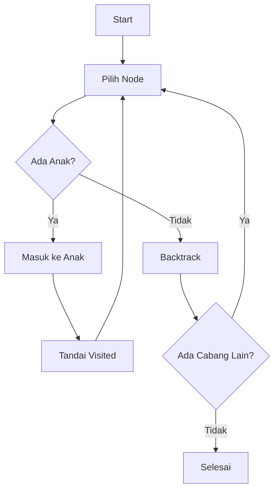
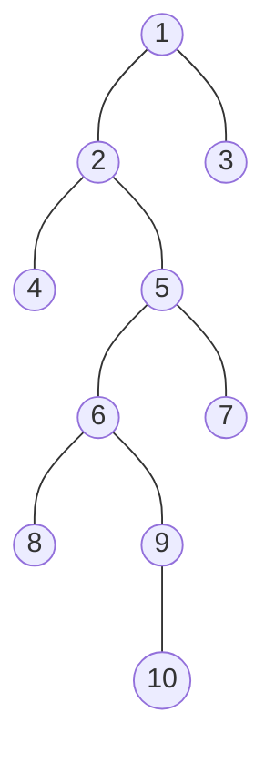

# 🎮 Depth-First Search (DFS): Algoritma Pencarian Mendalam

### 📚 Desain dan Analisis Algoritma

## 📑 **Daftar Isi**

1. [🔍 Apa itu Depth-First Search?](#-apa-itu-depth-first-search)
2. [📐 Prinsip Utama DFS](#-prinsip-utama-dfs)
3. [🎯 Contoh Kasus](#-contoh-kasus)
4. [✅ Kelebihan DFS](#-kelebihan-dfs)
5. [❌ Kekurangan DFS](#-kekurangan-dfs)
6. [💻 Implementasi Code](#-implementasi-code)
7. [🎮 Aplikasi DFS](#-aplikasi-dfs)
8. [📊 Analisis Kompleksitas](#-analisis-kompleksitas)
9. [📝 Kesimpulan](#-kesimpulan)

---

## 🔍 **Apa itu Depth-First Search?**

> **Depth-First Search (DFS)** adalah algoritma pencarian atau penelusuran pada struktur data graf atau pohon yang bekerja dengan menjelajahi satu cabang sedalam mungkin sebelum mundur (backtrack) dan melanjutkan ke cabang berikutnya.

### 🎯 **Konsep Dasar:**

DFS menggunakan prinsip **"Go Deep, Then Back"** - telusuri sedalam mungkin, lalu kembali!

<div align="center">


```mermaid
graph TD
    A[Start] --> B[Pilih Node]
    B --> C{Ada Anak?}
    C -->|Ya| D[Masuk ke Anak]
    C -->|Tidak| E[Backtrack]
    D --> F[Tandai Visited]
    F --> B
    E --> G{Ada Cabang Lain?}
    G -->|Ya| B
    G -->|Tidak| H[Selesai]
```

</div>

---

## 📐 **Prinsip Utama DFS**

### 📚 **Stack (LIFO - Last In First Out)**

DFS menggunakan struktur data **Stack** untuk menyimpan node yang akan dikunjungi:

<div align="center">

| Langkah | Operasi | Ilustrasi Stack |
|:-------:|:--------|:----------------|
| 1️⃣ | **Push** node akar | `[A]` |
| 2️⃣ | **Pop** & proses node | `[]` → Process A |
| 3️⃣ | **Push** semua anak | `[B, C, D]` |
| 4️⃣ | **Pop** & ulangi | `[B, C]` → Process D |

</div>

### 🔄 **Langkah-langkah Algoritma:**

```python
1. Masukkan simpul (node) akar ke dalam stack
2. Ambil node dari stack teratas, lalu cek:
   • Jika node = solusi → pencarian selesai ✅
   • Jika bukan → masukkan semua anak ke stack
3. Jika stack kosong & semua node sudah dicek → pencarian berakhir
4. Jika stack tidak kosong → ulangi dari langkah 2
```

---

## 🎯 **Contoh Kasus**

### 🌳 **Graf Contoh:**

<div align="center">


```mermaid
graph TD
    1((1)) --- 2((2))
    2 --- 4((4))
    2 --- 5((5))
    1 --- 3((3))
    5 --- 6((6))
    5 --- 7((7))
    6 --- 8((8))
    6 --- 9((9))
    9 --- 10((10))
```

</div>

### 📊 **Proses Penelusuran DFS dari Node 1:**

#### 🎲 **Kemungkinan Urutan Eksplorasi:**

| Skenario | Urutan Kunjungan | Path |
|:--------:|:-----------------|:-----|
| 1️⃣ | `1 → 2 → 4 → 5 → 6 → 7 → 8 → 9 → 10 → 3` | Kiri dulu |
| 2️⃣ | `1 → 2 → 5 → 6 → 7 → 8 → 9 → 10 → 4 → 3` | Tengah dulu |
| 3️⃣ | `1 → 2 → 5 → 6 → 9 → 10 → 8 → 7 → 4 → 3` | Variasi lain |

### 🎯 **Pencarian Node 10:**

Jika kita mencari node **10** dengan akhir target:

```
📍 Start: 1
🎯 Target: 10
🛤️ Path: 1 → 2 → 4 → 6 → 9 → 10 ✅
```

---

## ✅ **Kelebihan DFS**

### 💾 **1. Penggunaan Memori Lebih Efisien**
- 📊 Hanya menyimpan node di jalur aktif
- 💪 Cocok untuk graf yang sangat besar
- 🎯 Space complexity: **O(h)** dimana h = kedalaman

### 🛠️ **2. Mudah Diimplementasikan**
- 📝 Kode sederhana dan intuitif
- 🔄 Dapat menggunakan rekursi
- 📚 Mudah dipahami konsepnya

### 🎯 **3. Cocok untuk Menemukan Solusi Kedalaman Maksimal**
- 🏔️ Sempurna untuk masalah yang memerlukan eksplorasi mendalam
- 🎲 Baik untuk puzzle dan game tree
- 🌳 Ideal untuk traversal pohon

### 🚀 **4. Digunakan dalam Banyak Algoritma Penting**
- 🔍 Topological sorting
- 🔗 Finding connected components
- 🎯 Detecting cycles
- 🧩 Solving maze problems

---

## ❌ **Kekurangan DFS**

### 🎯 **1. Tidak Menjamin Solusi Terbaik**
- ❓ Menemukan solusi, tapi belum tentu optimal
- 📏 Tidak cocok untuk shortest path
- 🎲 Tergantung urutan eksplorasi

### ♾️ **2. Bisa Masuk ke Infinite Loop**
- 🔄 Pada graf siklik tanpa penanganan
- ⚠️ Memerlukan tracking node yang sudah dikunjungi
- 🛑 Perlu mekanisme terminasi

### 🌍 **3. Kurang Efisien di Graf Luas tapi Dangkal**
- 📊 BFS lebih baik untuk kasus ini
- ⏱️ Bisa memakan waktu lama
- 🎯 Tidak optimal untuk semua struktur

### ❌ **4. Tidak Cocok untuk Semua Masalah**
- 📏 Shortest path → gunakan BFS/Dijkstra
- 🎯 Level-order traversal → gunakan BFS
- 🔍 Finding nearest neighbor → algoritma lain lebih baik

---

## 💻 **Implementasi Code**

### 🐍 **Python Implementation:**### ⚙️ **C++ Implementation:**

```cpp
#include <iostream>
#include <vector>
#include <stack>
#include <unordered_set>
using namespace std;

// 🎯 Fungsi DFS Iterative
void DFS(int start, vector<vector<int>>& graph, vector<bool>& visited) {
    stack<int> s;
    s.push(start);
    
    while (!s.empty()) {
        int node = s.top();
        s.pop();
        
        if (!visited[node]) {
            cout << node << " ";
            visited[node] = true;
        }
        
        // Push semua tetangga yang belum dikunjungi
        for (int neighbor : graph[node]) {
            if (!visited[neighbor]) {
                s.push(neighbor);
            }
        }
    }
}

// 🔄 Fungsi DFS Recursive
void DFSRecursive(int node, vector<vector<int>>& graph, vector<bool>& visited) {
    visited[node] = true;
    cout << node << " ";
    
    for (int neighbor : graph[node]) {
        if (!visited[neighbor]) {
            DFSRecursive(neighbor, graph, visited);
        }
    }
}
```

---

## 🎮 **Aplikasi DFS**

### 🌍 **Penggunaan DFS dalam Berbagai Bidang:**

| Aplikasi | Deskripsi | Emoji |
|:---------|:----------|:-----:|
| **Maze Solving** | Mencari jalan keluar dari labirin | 🗺️ |
| **Pathfinding Games** | AI untuk NPC dalam game | 🎮 |
| **Web Crawling** | Menjelajahi struktur website | 🕷️ |
| **Topological Sorting** | Pengurutan dependencies | 📊 |
| **Cycle Detection** | Mendeteksi loop dalam graf | 🔄 |
| **Tree Traversal** | Pre/In/Post-order traversal | 🌳 |
| **Chess AI** | Evaluasi gerakan dalam catur | ♟️ |
| **Network Analysis** | Analisis konektivitas jaringan | 🌐 |

### 🎯 **Contoh Real-World:**

#### 1️⃣ **File System Navigation**
```
📁 Root
├── 📁 Documents
│   ├── 📄 file1.txt
│   └── 📁 Projects
│       └── 📄 code.py
└── 📁 Pictures
    └── 🖼️ photo.jpg
```

#### 2️⃣ **Social Network Analysis**
- 👥 Finding connected groups
- 🔗 Analyzing relationships
- 📊 Community detection

#### 3️⃣ **Puzzle Solving**
- 🧩 Sudoku solver
- 🎲 8-puzzle problem
- 🏰 Knight's tour

---

## 📊 **Analisis Kompleksitas**

### ⏱️ **Time Complexity:**

| Kasus | Kompleksitas | Keterangan |
|:------|:------------|:-----------|
| **Best Case** | O(1) | Target di node awal |
| **Average Case** | O(V + E) | V = vertices, E = edges |
| **Worst Case** | O(V + E) | Harus visit semua node |

### 💾 **Space Complexity:**

| Implementasi | Kompleksitas | Keterangan |
|:------------|:------------|:-----------|
| **Recursive** | O(h) | h = height/depth |
| **Iterative** | O(V) | Stack bisa contain semua vertices |

### 📈 **Perbandingan dengan BFS:**

| Aspek | DFS | BFS |
|:------|:----|:----|
| **Memory** | ✅ Lebih efisien | ❌ Lebih boros |
| **Shortest Path** | ❌ Tidak guarantee | ✅ Guarantee |
| **Implementation** | ✅ Lebih simple | 🔄 Moderate |
| **Deep Graph** | ✅ Sangat baik | ❌ Kurang baik |
| **Wide Graph** | ❌ Kurang baik | ✅ Sangat baik |

---

## 📝 **Kesimpulan**

### 🎯 **Key Takeaways:**

> **DFS** merupakan algoritma penelusuran pada struktur data graf atau pohon yang menjelajahi simpul sedalam mungkin sebelum kembali (backtracking) dan melanjutkan ke simpul lainnya.

### 💡 **Poin Penting:**

1. **📚 Stack-Based**: Menggunakan LIFO untuk tracking
2. **🎯 Deep Exploration**: Prioritas kedalaman
3. **💾 Memory Efficient**: Cocok untuk graf besar
4. **🔄 Backtracking**: Kembali saat menemui dead-end
5. **🛠️ Versatile**: Banyak aplikasi praktis

### 🚀 **Kapan Menggunakan DFS:**

✅ **Gunakan DFS ketika:**
- Mencari solusi pada kedalaman maksimal
- Memory terbatas
- Struktur data berbentuk pohon/deep
- Tidak perlu shortest path

❌ **Hindari DFS ketika:**
- Butuh shortest path
- Graf sangat lebar tapi dangkal
- Ada kemungkinan infinite loop
- Perlu level-order traversal

### 🎮 **Tips Implementation:**

1. 🏷️ Selalu track visited nodes
2. 🔄 Pilih recursive vs iterative sesuai kebutuhan
3. ⚠️ Handle cycle detection untuk graf siklik
4. 📊 Pertimbangkan struktur graf sebelum memilih algoritma

