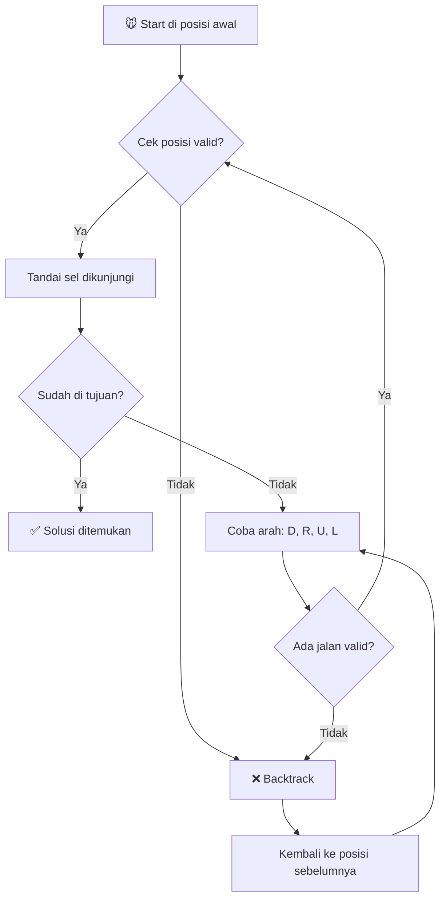

# 🐭 Rat in a Maze: Backtracking Algorithm

### 📚 Desain dan Analisis Algoritma

## 📑 **Daftar Isi**

1. [🔍 Definisi](#-definisi)
2. [⚙️ Prinsip Kerja](#️-prinsip-kerja)
3. [📋 Contoh Permasalahan](#-contoh-permasalahan)
4. [🎯 Simulasi Algoritma](#-simulasi-algoritma)
5. [💻 Implementasi Kode](#-implementasi-kode)
6. [⚖️ Kelebihan & Kekurangan](#️-kelebihan--kekurangan)
7. [🌍 Implementasi Dunia Nyata](#-implementasi-dunia-nyata)
8. [📊 Analisis Kompleksitas](#-analisis-kompleksitas)
9. [📝 Kesimpulan](#-kesimpulan)

---

## 🔍 **Definisi**

> **Rat in a Maze** merupakan salah satu algorithm problem di mana seekor tikus (rat) harus keluar dari sebuah labirin (maze) dengan mengikuti jalur tertentu, dari titik awal ke titik tujuan.

### 🎯 **Konsep Dasar:**

<div align="center">


</div>

**Rat in a Maze** adalah masalah klasik yang diselesaikan menggunakan **algoritma backtracking**, di mana:

- 🐭 **Tikus** harus menemukan jalan dari posisi awal ke tujuan
- 🏛️ **Labirin** direpresentasikan sebagai matriks/grid
- ✅ **Sel bernilai 1** = dapat dilewati (jalan)
- ❌ **Sel bernilai 0** = tidak dapat dilewati (tembok)
- 🔄 **Backtrack** jika jalan buntu

---

## ⚙️ **Prinsip Kerja**

### 📐 **Langkah-langkah Algoritma:**

<div align="center">



</div>

### 🧭 **Aturan Pergerakan:**

| Arah | Simbol | Gerakan | Koordinat |
|:----:|:------:|:--------|:----------|
| ⬇️ | **D** | Down (Bawah) | `(i+1, j)` |
| ➡️ | **R** | Right (Kanan) | `(i, j+1)` |
| ⬆️ | **U** | Up (Atas) | `(i-1, j)` |
| ⬅️ | **L** | Left (Kiri) | `(i, j-1)` |

### 🔢 **Nilai Sel Matriks:**

- **1️⃣** = Jalan (dapat dilewati)
- **0️⃣** = Tembok (tidak dapat dilewati)

---

## 📋 **Contoh Permasalahan**

### 🎯 **Problem Statement:**

> Seekor tikus ditempatkan di posisi **(0,0)** dalam matriks persegi berorde **N×N**. Tikus harus mencapai tujuan di **(N-1, N-1)**. Temukan semua kemungkinan jalur yang dapat diambil tikus untuk mencapai dari sumber ke tujuan.

### 🗺️ **Contoh Maze 4×4:**

<div align="center">

| | 0 | 1 | 2 | 3 |
|:---:|:---:|:---:|:---:|:---:|
| **0** | 🐭 1 | 0 | 0 | 0 |
| **1** | 1 | 1 | 0 | 1 |
| **2** | 1 | 1 | 0 | 0 |
| **3** | 0 | 1 | 1 | 🏁 1 |

</div>

**Keterangan:**
- 🐭 = Start (0,0)
- 🏁 = End (3,3)
- 1 = Jalan
- 0 = Tembok

---

## 🎯 **Simulasi Algoritma**

### 📍 **Step-by-Step Simulation:**

#### **Langkah 1: Inisialisasi**
```
Posisi: (0,0)
Cek arah yang mungkin:
- Bawah (D) → (1,0) = 1 ✅
- Kanan (R) → (0,1) = 0 ❌
Pilih: D
```

#### **Langkah 2: Dari (1,0)**
```
Posisi: (1,0)
Tandai (1,0) sebagai visited
Cek arah:
- Bawah (D) → (2,0) = 1 ✅
- Kanan (R) → (1,1) = 1 ✅
Pilih: R
```

#### **Langkah 3-6: Lanjutan**

<div align="center">

### 🎮 **Visualisasi Jalur Akhir:**

| | 0 | 1 | 2 | 3 |
|:---:|:---:|:---:|:---:|:---:|
| **0** | 🟩 | ⬛ | ⬛ | ⬛ |
| **1** | 🟩 | 🟩 | ⬛ | ⬜ |
| **2** | ⬜ | 🟩 | ⬛ | ⬛ |
| **3** | ⬛ | 🟩 | 🟩 | 🟩 |

</div>

**Hasil Jalur:**
- **Jalur 1**: D → R → D → D → R → R ✅
- **Jalur 2**: D → D → R → D → R → R ✅

---

## 💻 **Implementasi Kode**

### 🔧 **C++ Implementation:**

```cpp
#include <iostream>
#include <vector>
#include <string>

using namespace std;

class RatInMaze {
private:
    int n;
    vector<vector<int>> maze;
    vector<vector<int>> visited;
    vector<string> paths;
    
public:
    RatInMaze(vector<vector<int>>& m) {
        maze = m;
        n = m.size();
        visited.resize(n, vector<int>(n, 0));
    }
    
    // 🔍 Check if position is safe
    bool isSafe(int x, int y) {
        return (x >= 0 && x < n && y >= 0 && y < n && 
                maze[x][y] == 1 && visited[x][y] == 0);
    }
    
    // 🎯 Main solving function
    void solve(int x, int y, string path) {
        // Base case: reached destination
        if (x == n-1 && y == n-1) {
            paths.push_back(path);
            return;
        }
        
        // Mark current cell as visited
        visited[x][y] = 1;
        
        // Try all 4 directions
        // Down ⬇️
        if (isSafe(x + 1, y)) {
            solve(x + 1, y, path + 'D');
        }
        
        // Right ➡️
        if (isSafe(x, y + 1)) {
            solve(x, y + 1, path + 'R');
        }
        
        // Up ⬆️
        if (isSafe(x - 1, y)) {
            solve(x - 1, y, path + 'U');
        }
        
        // Left ⬅️
        if (isSafe(x, y - 1)) {
            solve(x, y - 1, path + 'L');
        }
        
        // Backtrack: unmark current cell
        visited[x][y] = 0;
    }
    
    // 📊 Display all paths
    void printPaths() {
        if (paths.empty()) {
            cout << "❌ No solution exists!" << endl;
            return;
        }
        
        cout << "✅ Found " << paths.size() << " path(s):" << endl;
        for (int i = 0; i < paths.size(); i++) {
            cout << "Path " << i+1 << ": " << paths[i] << endl;
        }
    }
};

// 🚀 Main function
int main() {
    vector<vector<int>> maze = {
        {1, 0, 0, 0},
        {1, 1, 0, 1},
        {1, 1, 0, 0},
        {0, 1, 1, 1}
    };
    
    RatInMaze rim(maze);
    rim.solve(0, 0, "");
    rim.printPaths();
    
    return 0;
}
```

### 🐍 **Python Implementation:**

```python
class RatInMaze:
    def __init__(self, maze):
        self.maze = maze
        self.n = len(maze)
        self.visited = [[False] * self.n for _ in range(self.n)]
        self.paths = []
    
    def is_safe(self, x, y):
        """🔍 Check if position is valid"""
        return (0 <= x < self.n and 0 <= y < self.n and 
                self.maze[x][y] == 1 and not self.visited[x][y])
    
    def solve(self, x=0, y=0, path=""):
        """🎯 Main backtracking function"""
        # Base case: reached destination
        if x == self.n - 1 and y == self.n - 1:
            self.paths.append(path)
            return
        
        # Mark current cell as visited
        self.visited[x][y] = True
        
        # Try all 4 directions
        directions = [
            (1, 0, 'D'),   # Down ⬇️
            (0, 1, 'R'),   # Right ➡️
            (-1, 0, 'U'),  # Up ⬆️
            (0, -1, 'L')   # Left ⬅️
        ]
        
        for dx, dy, direction in directions:
            nx, ny = x + dx, y + dy
            if self.is_safe(nx, ny):
                self.solve(nx, ny, path + direction)
        
        # Backtrack
        self.visited[x][y] = False
    
    def display_solution(self):
        """📊 Display all found paths"""
        if not self.paths:
            print("❌ No solution exists!")
            return
        
        print(f"✅ Found {len(self.paths)} path(s):")
        for i, path in enumerate(self.paths, 1):
            print(f"Path {i}: {path}")
```

---

## ⚖️ **Kelebihan & Kekurangan**

### ✅ **Kelebihan**

| No | Kelebihan | Deskripsi |
|:---:|:---------|:----------|
| 1️⃣ | **Sederhana** | 🎯 Mudah dipahami dan diimplementasikan |
| 2️⃣ | **Lengkap** | 🔍 Menemukan semua solusi yang mungkin |
| 3️⃣ | **Fleksibel** | 🔄 Dapat dimodifikasi untuk berbagai variasi |
| 4️⃣ | **Efisien Memori** | 💾 Tidak memerlukan struktur data kompleks |

### ❌ **Kekurangan**

| No | Kekurangan | Deskripsi |
|:---:|:----------|:----------|
| 1️⃣ | **Tidak Efisien** | ⏱️ Kompleksitas eksponensial untuk maze besar |
| 2️⃣ | **Stack Overflow** | 💥 Risiko pada maze yang sangat besar |
| 3️⃣ | **Tidak Optimal** | 📏 Tidak menjamin jalur terpendek |
| 4️⃣ | **Redundansi** | 🔁 Dapat mengulang jalur jika tidak diatur |

---

## 🌍 **Implementasi Dunia Nyata**

### 1️⃣ **Robot Navigasi 🤖**
- Vacuum cleaner otomatis
- Robot warehouse
- Drone pathfinding

### 2️⃣ **GPS & Navigasi 🗺️**
- Pencarian rute alternatif
- Navigasi dalam gedung
- Emergency evacuation routes

### 3️⃣ **Game & Simulasi 🎮**
- Maze solving games
- AI pathfinding dalam game
- Puzzle solving algorithms

### 4️⃣ **Aplikasi Lainnya 🔧**
- Circuit board routing
- Network packet routing
- Data structure traversal

---

## 📊 **Analisis Kompleksitas**

### ⏱️ **Time Complexity:**

| Kasus | Kompleksitas | Keterangan |
|:------|:------------|:-----------|
| **Best Case** | O(1) | Langsung menemukan solusi |
| **Average Case** | O(4^(n²)) | Eksplorasi partial |
| **Worst Case** | O(4^(n²)) | Eksplorasi semua kemungkinan |

### 💾 **Space Complexity:**

- **Recursive Call Stack**: O(n²)
- **Visited Array**: O(n²)
- **Total**: O(n²)

### 📈 **Perbandingan dengan Algoritma Lain:**

| Algoritma | Time | Space | Optimal Path |
|:----------|:-----|:------|:-------------|
| **Backtracking** | O(4^(n²)) | O(n²) | ❌ |
| **BFS** | O(n²) | O(n²) | ✅ |
| **DFS** | O(n²) | O(n²) | ❌ |
| **A*** | O(n²) | O(n²) | ✅ |

---

## 📝 **Kesimpulan**

### 🎯 **Key Takeaways:**

> **Rat in a Maze** dengan **Backtracking** adalah algoritma klasik yang mendemonstrasikan kekuatan pendekatan systematic trial-and-error dalam pemecahan masalah.

### 💡 **Poin Penting:**

1. **🔄 Backtracking** = Explore + Mark + Recurse + Unmark
2. **🎯 Systematic Approach** untuk mencoba semua kemungkinan
3. **✅ Complete** tapi **❌ Not Optimal**
4. **💻 Mudah diimplementasi** untuk pembelajaran
5. **🌍 Aplikasi luas** dalam berbagai domain

### 🚀 **Best Practices:**

- ✅ Gunakan untuk maze kecil-sedang
- ✅ Cocok untuk menemukan semua solusi
- ⚠️ Pertimbangkan BFS/A* untuk jalur terpendek
- 💡 Optimasi dengan pruning untuk performa
