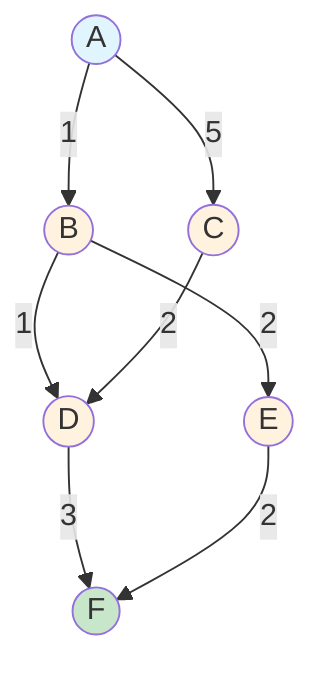

# Dijkstra's Algorithm: Pencarian Jalur Terpendek

## 📋 Daftar Isi
- [Pengertian](#pengertian)
- [Cara Kerja](#cara-kerja)
- [Contoh Implementasi](#contoh-implementasi)
- [Aplikasi Praktis](#aplikasi-praktis)
- [Analisis Algoritma](#analisis-algoritma)
- [Kesimpulan](#kesimpulan)

---

## 🎯 Pengertian {#pengertian}

**Dijkstra's Algorithm** adalah algoritma greedy yang digunakan untuk menemukan jalur terpendek dari satu simpul sumber ke semua simpul lainnya dalam graf berbobot dengan bobot non-negatif.

> **Dikembangkan oleh**: Edsger W. Dijkstra pada tahun 1956
> 
> **Kompleksitas Waktu**: O((V + E) log V) dengan priority queue
> 
> **Jenis**: Algoritma Greedy
{: .prompt-info }

### Karakteristik Utama

| Aspek | Deskripsi |
|-------|-----------|
| **Input** | Graf berbobot dengan bobot non-negatif |
| **Output** | Jarak terpendek dari simpul sumber ke semua simpul |
| **Pendekatan** | Greedy Algorithm |
| **Struktur Data** | Priority Queue (Min-Heap) |

---

## ⚙️ Cara Kerja {#cara-kerja}

Algoritma Dijkstra bekerja dengan prinsip **relaxation** dan **greedy choice**:

### Langkah-langkah Algoritma

```
1. INISIALISASI
   ├── Set jarak semua simpul = ∞
   ├── Set jarak simpul sumber = 0
   └── Masukkan semua simpul ke priority queue

2. ITERASI UTAMA
   ├── Pilih simpul dengan jarak minimum (belum dikunjungi)
   ├── Tandai simpul sebagai "dikunjungi"
   └── Update jarak ke semua tetangga

3. RELAXATION
   ├── Untuk setiap tetangga u dari simpul v:
   ├── Jika jarak[v] + bobot(v,u) < jarak[u]
   └── Update jarak[u] = jarak[v] + bobot(v,u)

4. TERMINASI
   └── Ulangi sampai semua simpul dikunjungi
```

### Pseudocode

```python
function Dijkstra(Graph, source):
    distance = array of size V initialized to ∞
    visited = array of size V initialized to false
    distance[source] = 0
    
    for i = 0 to V-1:
        u = vertex with minimum distance and not visited
        visited[u] = true
        
        for each neighbor v of u:
            if not visited[v] and distance[u] + weight(u,v) < distance[v]:
                distance[v] = distance[u] + weight(u,v)
    
    return distance
```

---

## 💡 Contoh Implementasi {#contoh-implementasi}

### Graf Contoh



### Proses Perhitungan Step-by-Step

| Iterasi | Simpul Aktif | Jarak dari A | Status Simpul |
|---------|--------------|--------------|---------------|
| **0** | A | A:0, B:∞, C:∞, D:∞, E:∞, F:∞ | A: visited |
| **1** | B | A:0, B:1, C:5, D:∞, E:∞, F:∞ | A,B: visited |
| **2** | D | A:0, B:1, C:5, D:2, E:3, F:∞ | A,B,D: visited |
| **3** | E | A:0, B:1, C:5, D:2, E:3, F:5 | A,B,D,E: visited |
| **4** | C | A:0, B:1, C:4, D:2, E:3, F:5 | A,B,D,E,C: visited |
| **5** | F | A:0, B:1, C:4, D:2, E:3, F:4 | Semua visited |

### Hasil Akhir

> **Jalur Terpendek A → F**: `A → B → E → F` atau `A → B → D → F`
> 
> **Jarak Total**: `4`
{: .prompt-tip }

---

## 🌍 Aplikasi Praktis {#aplikasi-praktis}

### 1. 🗺️ Sistem Navigasi GPS

```
Skenario: Mencari rute tercepat dari rumah ke kantor
├── Simpul: Persimpangan jalan
├── Edge: Ruas jalan
├── Bobot: Waktu tempuh / jarak
└── Output: Rute optimal dengan estimasi waktu
```

### 2. 📦 Optimasi Logistik

```
Skenario: Pengiriman paket dengan biaya minimum
├── Simpul: Kota/depot
├── Edge: Jalur transportasi
├── Bobot: Biaya pengiriman
└── Output: Rute pengiriman termurah
```

### 3. 🌐 Network Routing

```
Skenario: Routing paket data di internet
├── Simpul: Router/node jaringan
├── Edge: Koneksi jaringan
├── Bobot: Latency/bandwidth
└── Output: Path optimal untuk transmisi data
```

### 4. 🎮 Game Development

```
Skenario: AI pathfinding untuk NPC
├── Simpul: Posisi di grid/waypoint
├── Edge: Jalur yang dapat dilalui
├── Bobot: Jarak/difficulty terrain
└── Output: Path pergerakan AI yang optimal
```

---

## 📊 Analisis Algoritma {#analisis-algoritma}

### Kompleksitas

| Implementasi | Kompleksitas Waktu | Kompleksitas Ruang |
|--------------|-------------------|-------------------|
| **Array sederhana** | O(V²) | O(V) |
| **Binary Heap** | O((V + E) log V) | O(V) |
| **Fibonacci Heap** | O(E + V log V) | O(V) |

> **V** = Jumlah simpul (vertices)
> 
> **E** = Jumlah sisi (edges)
{: .prompt-info }

### 🟢 Kelebihan

| No | Kelebihan | Penjelasan |
|----|-----------|------------|
| **1** | **Optimal Solution** | Selalu menemukan jalur terpendek yang optimal |
| **2** | **Single-Source Multi-Target** | Satu eksekusi menghasilkan jarak ke semua simpul |
| **3** | **Efisien untuk Graf Padat** | Performa baik pada graf dengan banyak koneksi |
| **4** | **Implementasi Sederhana** | Konsep mudah dipahami dan diimplementasikan |
| **5** | **Aplikasi Luas** | Banyak digunakan dalam berbagai domain |

### 🔴 Kekurangan

| No | Kekurangan | Solusi/Alternatif |
|----|------------|-------------------|
| **1** | **Tidak Support Bobot Negatif** | Gunakan Bellman-Ford Algorithm |
| **2** | **Inefficient untuk Graf Sparse** | Gunakan A* untuk target spesifik |
| **3** | **Overhead untuk Single Target** | Gunakan bidirectional search |
| **4** | **Memory Intensive** | Optimasi dengan struktur data khusus |

---

## 📈 Perbandingan dengan Algoritma Lain

| Algoritma | Bobot Negatif | Kompleksitas | Best Use Case |
|-----------|---------------|--------------|---------------|
| **Dijkstra** | ❌ | O((V+E) log V) | Graf positif, single-source |
| **Bellman-Ford** | ✅ | O(VE) | Graf dengan bobot negatif |
| **Floyd-Warshall** | ✅ | O(V³) | All-pairs shortest path |
| **A*** | ❌ | O(b^d) | Single-target dengan heuristic |

---

## 🎯 Kesimpulan {#kesimpulan}

Algoritma Dijkstra adalah salah satu algoritma fundamental dalam computer science yang memberikan solusi optimal untuk masalah shortest path. Dengan pendekatan greedy yang elegant, algoritma ini memastikan efisiensi dan akurasi dalam berbagai aplikasi praktis.

### Key Takeaways

- **Greedy Approach**: Setiap langkah memilih solusi lokal terbaik
- **Optimal Substructure**: Jalur terpendek terdiri dari sub-jalur terpendek
- **Wide Applications**: Dari GPS hingga network routing
- **Performance**: Excellent untuk graf dengan bobot non-negatif

> **💡 Tips Implementasi**
> 
> - Gunakan priority queue untuk optimasi performa
> - Pertimbangkan A* untuk target spesifik
> - Validasi input untuk bobot non-negatif
> - Implementasi early termination untuk single target
{: .prompt-tip }

---
