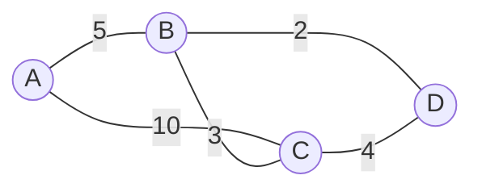
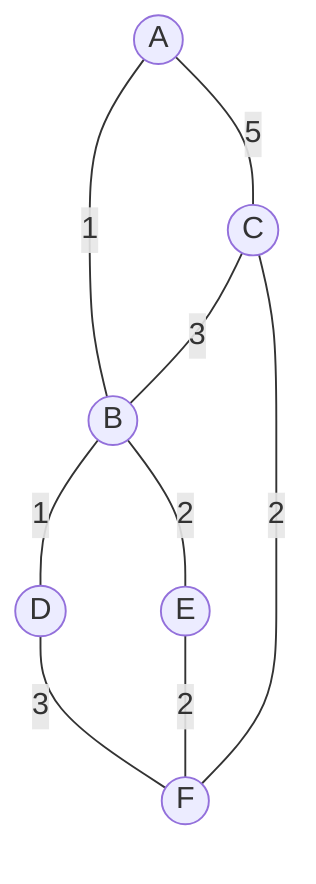

# 🎮 Dijkstra's Algorithm: Algoritma Pencarian Jalur Terpendek

### 📚 Desain dan Analisis Algoritma


## 📑 **Daftar Isi**

1. [🔍 Apa itu Dijkstra's Algorithm?](#-apa-itu-dijkstras-algorithm)
2. [⚙️ Cara Kerja Dijkstra's Algorithm](#️-cara-kerja-dijkstras-algorithm)
3. [📊 Contoh Permasalahan](#-contoh-permasalahan)
4. [💻 Implementasi Kode](#-implementasi-kode)
5. [🌍 Contoh Penggunaan](#-contoh-penggunaan)
6. [✅ Kelebihan Dijkstra's Algorithm](#-kelebihan-dijkstras-algorithm)
7. [❌ Kekurangan Dijkstra's Algorithm](#-kekurangan-dijkstras-algorithm)
8. [📝 Kesimpulan](#-kesimpulan)

---

## 🔍 **Apa itu Dijkstra's Algorithm?**

> **Dijkstra's Algorithm** adalah sebuah metode yang digunakan untuk mencari jalur terpendek antara dua titik dalam sebuah graf. Graf ini bisa berupa jaringan yang terdiri dari simpul (titik) dan sisi (hubungan antar titik) dengan bobot tertentu pada sisi-sisinya.

### 🎯 **Tujuan Utama:**
Algoritma ini membantu kita menentukan **jalur terpendek** dari titik awal ke titik tujuan dengan mempertimbangkan bobot pada setiap sisi graf.

### 📐 **Komponen Graf:**
- **📍 Simpul (Vertex)**: Titik-titik dalam graf
- **🔗 Sisi (Edge)**: Hubungan antar titik
- **⚖️ Bobot (Weight)**: Nilai/jarak pada setiap sisi

<div align="center">


```mermaid
graph LR
    A((A)) ---|5| B((B))
    A ---|10| C((C))
    B ---|3| C((C))
    B ---|2| D((D))
    C ---|4| D((D))
```

</div>

---

## ⚙️ **Cara Kerja Dijkstra's Algorithm**

### 📋 **Langkah-langkah Algoritma:**

#### 1️⃣ **Inisialisasi**
- 📊 Buat tabel dengan kolom untuk nilai/jarak dari simpul
- 📍 Baris sebagai posisi simpul
- ♾️ Set semua jarak ke infinity kecuali simpul awal (0)

#### 2️⃣ **Pemilihan Simpul**
- 🎯 Pilih simpul awal dan simpul tujuan
- ✅ Pastikan simpul terhubung secara langsung

#### 3️⃣ **Perhitungan Jarak**
- 🧮 Hitung jarak ke semua simpul tetangga
- 🔄 Update jarak jika ditemukan jalur lebih pendek

#### 4️⃣ **Pemilihan Jalur Terpendek**
- 🏆 Pilih simpul dengan jarak terpendek yang belum dikunjungi
- 📌 Tandai simpul tersebut sebagai "dikunjungi"

#### 5️⃣ **Iterasi**
- 🔁 Ulangi langkah 3-4 sampai semua simpul dikunjungi
- ✨ Atau sampai simpul tujuan tercapai

### 🔄 **Pseudocode:**

```python
function Dijkstra(Graph, source):
    # Inisialisasi
    for each vertex v in Graph:
        distance[v] ← INFINITY
        previous[v] ← UNDEFINED
    
    distance[source] ← 0
    Q ← all vertices in Graph
    
    # Main loop
    while Q is not empty:
        u ← vertex in Q with minimum distance[u]
        remove u from Q
        
        for each neighbor v of u:
            alt ← distance[u] + weight(u, v)
            if alt < distance[v]:
                distance[v] ← alt
                previous[v] ← u
    
    return distance[], previous[]
```

---

## 📊 **Contoh Permasalahan**

### 🎯 **Soal:**
> Carilah nilai dan lintasan terpendek dari simpul **A** ke **F**!

### 🗺️ **Graf:**

<div align="center">


```mermaid
graph TD
    A((A)) ---|1| B((B))
    A ---|5| C((C))
    B ---|1| D((D))
    B ---|2| E((E))
    C ---|3| B((B))
    C ---|2| F((F))
    D ---|3| F((F))
    E ---|2| F((F))
```

</div>

### 📊 **Tabel Penyelesaian:**

| Iterasi | Vertex | A | B | C | D | E | F | Path |
|:-------:|:------:|:-:|:-:|:-:|:-:|:-:|:-:|:-----|
| 0️⃣ | - | 0 | ∞ | ∞ | ∞ | ∞ | ∞ | - |
| 1️⃣ | A | **0** | 1 | 5 | ∞ | ∞ | ∞ | A→B, A→C |
| 2️⃣ | B | 0 | **1** | 5 | 2 | 3 | ∞ | A→B→D, A→B→E |
| 3️⃣ | D | 0 | 1 | 5 | **2** | 3 | 5 | A→B→D→F |
| 4️⃣ | E | 0 | 1 | 5 | 2 | **3** | 4 | A→B→E→F |
| 5️⃣ | F | 0 | 1 | 5 | 2 | 3 | **4** | ✅ |

### 🎉 **Hasil:**
- **📏 Jarak Terpendek**: 4
- **🛤️ Lintasan**: A → B → E → F atau A → B → D → F

---

## 💻 **Implementasi Kode**

### 🐍 **Python Implementation:**

```python
import heapq
from typing import Dict, List, Tuple

class Dijkstra:
    def __init__(self):
        self.graph = {}
    
    def add_edge(self, u: str, v: str, weight: int):
        """Menambahkan edge ke graf"""
        if u not in self.graph:
            self.graph[u] = []
        if v not in self.graph:
            self.graph[v] = []
        
        self.graph[u].append((v, weight))
        # Untuk graf tidak berarah, uncomment line berikut:
        # self.graph[v].append((u, weight))
    
    def dijkstra(self, start: str) -> Tuple[Dict[str, int], Dict[str, str]]:
        """
        Implementasi algoritma Dijkstra
        Returns: (distances, previous)
        """
        # 📊 Inisialisasi
        distances = {node: float('infinity') for node in self.graph}
        distances[start] = 0
        previous = {node: None for node in self.graph}
        
        # 🎯 Priority queue: (distance, node)
        pq = [(0, start)]
        visited = set()
        
        while pq:
            current_distance, current_node = heapq.heappop(pq)
            
            # Skip jika sudah dikunjungi
            if current_node in visited:
                continue
            
            visited.add(current_node)
            
            # 🔍 Cek semua tetangga
            for neighbor, weight in self.graph.get(current_node, []):
                distance = current_distance + weight
                
                # 🔄 Update jika ditemukan jalur lebih pendek
                if distance < distances[neighbor]:
                    distances[neighbor] = distance
                    previous[neighbor] = current_node
                    heapq.heappush(pq, (distance, neighbor))
        
        return distances, previous
    
    def get_shortest_path(self, start: str, end: str) -> Tuple[List[str], int]:
        """
        Mendapatkan jalur terpendek dari start ke end
        Returns: (path, distance)
        """
        distances, previous = self.dijkstra(start)
        
        # 🛤️ Rekonstruksi jalur
        path = []
        current = end
        
        while current is not None:
            path.append(current)
            current = previous[current]
        
        path.reverse()
        
        # Validasi jalur
        if path[0] != start:
            return [], float('infinity')
        
        return path, distances[end]
    
    def display_result(self, start: str, end: str):
        """Menampilkan hasil dengan format yang bagus"""
        path, distance = self.get_shortest_path(start, end)
        
        print("🎯 Dijkstra's Algorithm Result")
        print("=" * 40)
        print(f"📍 Start: {start}")
        print(f"🏁 End: {end}")
        
        if distance == float('infinity'):
            print("❌ Tidak ada jalur yang tersedia!")
        else:
            print(f"📏 Jarak Terpendek: {distance}")
            print(f"🛤️  Jalur: {' → '.join(path)}")

# 🚀 Contoh penggunaan
if __name__ == "__main__":
    # Membuat graf
    dijkstra = Dijkstra()
    
    # Menambahkan edges sesuai contoh
    dijkstra.add_edge('A', 'B', 1)
    dijkstra.add_edge('A', 'C', 5)
    dijkstra.add_edge('B', 'D', 1)
    dijkstra.add_edge('B', 'E', 2)
    dijkstra.add_edge('C', 'B', 3)
    dijkstra.add_edge('C', 'F', 2)
    dijkstra.add_edge('D', 'F', 3)
    dijkstra.add_edge('E', 'F', 2)
    
    # Mencari jalur terpendek
    dijkstra.display_result('A', 'F')
```

### ⚙️ **C++ Implementation:**

```cpp
#include <iostream>
#include <vector>
#include <queue>
#include <limits>
#include <unordered_map>
#include <algorithm>

using namespace std;

class Dijkstra {
private:
    // Graf menggunakan adjacency list
    unordered_map<char, vector<pair<char, int>>> graph;
    
public:
    // 🔗 Menambahkan edge
    void addEdge(char u, char v, int weight) {
        graph[u].push_back({v, weight});
    }
    
    // 🎯 Algoritma Dijkstra
    pair<unordered_map<char, int>, unordered_map<char, char>> dijkstra(char start) {
        unordered_map<char, int> distances;
        unordered_map<char, char> previous;
        
        // 📊 Inisialisasi
        for (auto& node : graph) {
            distances[node.first] = numeric_limits<int>::max();
            previous[node.first] = '\0';
        }
        distances[start] = 0;
        
        // Priority queue: {distance, node}
        priority_queue<pair<int, char>, vector<pair<int, char>>, greater<>> pq;
        pq.push({0, start});
        
        while (!pq.empty()) {
            int currentDist = pq.top().first;
            char currentNode = pq.top().second;
            pq.pop();
            
            // Skip jika sudah diproses
            if (currentDist > distances[currentNode]) continue;
            
            // 🔍 Cek semua tetangga
            for (auto& edge : graph[currentNode]) {
                char neighbor = edge.first;
                int weight = edge.second;
                int newDist = currentDist + weight;
                
                // 🔄 Update jika lebih pendek
                if (newDist < distances[neighbor]) {
                    distances[neighbor] = newDist;
                    previous[neighbor] = currentNode;
                    pq.push({newDist, neighbor});
                }
            }
        }
        
        return {distances, previous};
    }
    
    // 🛤️ Mendapatkan jalur
    void displayPath(char start, char end) {
        auto [distances, previous] = dijkstra(start);
        
        cout << "🎯 Dijkstra's Algorithm Result\n";
        cout << "========================================\n";
        cout << "📍 Start: " << start << "\n";
        cout << "🏁 End: " << end << "\n";
        
        if (distances[end] == numeric_limits<int>::max()) {
            cout << "❌ Tidak ada jalur yang tersedia!\n";
            return;
        }
        
        // Rekonstruksi jalur
        vector<char> path;
        char current = end;
        while (current != '\0') {
            path.push_back(current);
            current = previous[current];
        }
        reverse(path.begin(), path.end());
        
        cout << "📏 Jarak Terpendek: " << distances[end] << "\n";
        cout << "🛤️  Jalur: ";
        for (int i = 0; i < path.size(); i++) {
            cout << path[i];
            if (i < path.size() - 1) cout << " → ";
        }
        cout << "\n";
    }
};

// 🚀 Main function
int main() {
    Dijkstra dijkstra;
    
    // Menambahkan edges
    dijkstra.addEdge('A', 'B', 1);
    dijkstra.addEdge('A', 'C', 5);
    dijkstra.addEdge('B', 'D', 1);
    dijkstra.addEdge('B', 'E', 2);
    dijkstra.addEdge('C', 'B', 3);
    dijkstra.addEdge('C', 'F', 2);
    dijkstra.addEdge('D', 'F', 3);
    dijkstra.addEdge('E', 'F', 2);
    
    dijkstra.displayPath('A', 'F');
    
    return 0;
}
```

---

## 🌍 **Contoh Penggunaan**

### 1️⃣ **Navigasi Jalan 🗺️**

> Misalnya kita ingin mencari rute terpendek dari rumah ke sekolah. Dijkstra's Algorithm akan membantu kita menentukan jalan mana yang lebih pendek dengan mempertimbangkan semua jalan yang ada dan menghitung jarak yang terpendek dari rumah ke sekolah.

**Aplikasi Nyata:**
- 🚗 **Google Maps**
- 🗺️ **Waze**
- 📍 **GPS Navigation**

### 2️⃣ **Pengiriman Barang 📦**

> Sebuah perusahaan ekspedisi ingin mengirim paket dari gudang ke beberapa pelanggan. Dijkstra's Algorithm akan membantu menentukan rute pengiriman yang paling efisien agar paket bisa sampai lebih cepat dan tidak boros bensin atau tenaga.

**Aplikasi Nyata:**
- 🚚 **Sistem Logistik**
- 📮 **Routing Kurir**
- 🏭 **Supply Chain Management**

### 3️⃣ **Aplikasi Lainnya 🌐**

| Bidang | Aplikasi |
|:-------|:---------|
| 🌐 **Jaringan Komputer** | Routing protokol (OSPF, IS-IS) |
| 🎮 **Game Development** | Pathfinding untuk NPC |
| ✈️ **Penerbangan** | Rute penerbangan optimal |
| 📡 **Telekomunikasi** | Routing panggilan telepon |
| 🚇 **Transportasi Publik** | Rute tercepat dalam sistem metro |

---

## ✅ **Kelebihan Dijkstra's Algorithm**

### 🏆 **1. Menjamin Jalur Terpendek**
- ✨ Selalu menemukan solusi **optimal** (jalur terpendek)
- 🎯 Dari titik asal ke **semua titik lain**
- ⚠️ Syarat: Semua bobot edge bernilai **positif**

### ⚡ **2. Efisien untuk Banyak Aplikasi**
- 🔧 Cocok untuk graf yang **padat** (dense graph)
- 🚀 Sering digunakan dalam aplikasi nyata:
  - 📱 GPS dan sistem navigasi
  - 🌐 Routing jaringan
  - 🎮 Game pathfinding

### 🎯 **3. Dapat Menyelesaikan Banyak Tujuan Sekaligus**
- 📊 Sekali dijalankan dari satu titik
- 📍 Memberikan informasi jarak ke **semua titik lain**
- 💾 Efisien untuk multiple queries

### 📈 **4. Kompleksitas yang Baik**
- ⏱️ **O(V²)** dengan array sederhana
- 🚀 **O((V + E) log V)** dengan binary heap
- ⚡ **O(V log V + E)** dengan Fibonacci heap

---

## ❌ **Kekurangan Dijkstra's Algorithm**

### 🚫 **1. Tidak Bekerja dengan Bobot Negatif**
- ❌ Tidak bisa digunakan jika ada edge dengan bobot negatif
- 🔄 Alternatif: Gunakan **Bellman-Ford Algorithm**

### 🐌 **2. Kurang Efisien untuk Graf Besar yang Jarang Terhubung**
- 📊 Pada graf yang sangat besar dan **sparse** (jarang terhubung)
- ⏰ Bisa menjadi lambat tanpa optimasi
- 💡 Solusi: Gunakan struktur data seperti **priority queue** atau **heap**

### 🎯 **3. Perhitungan Bisa Terlalu Luas**
- 🔍 Jika hanya butuh jalur dari A ke B
- 📊 Dijkstra tetap menghitung ke **semua titik**
- 💡 Alternatif: **A* Algorithm** untuk kasus spesifik

### 💾 **4. Penggunaan Memori**
- 📦 Membutuhkan penyimpanan untuk:
  - Jarak ke setiap vertex
  - Previous vertex untuk rekonstruksi path
  - Priority queue
- 🚨 Bisa jadi masalah untuk graf yang sangat besar

---

## 📝 **Kesimpulan**

> Algoritma Dijkstra merupakan salah satu algoritma pencarian jalur terpendek yang paling **efisien** dan **banyak digunakan** dalam teori graf.

### 🎯 **Key Points:**

1. **🔍 Cara Kerja**: Mencari jalur terpendek dari satu simpul sumber ke semua simpul lainnya
2. **⚙️ Metode**: Menggunakan pendekatan **greedy** untuk hasil optimal
3. **✅ Syarat**: Bekerja pada graf berbobot **non-negatif**
4. **⚡ Efisiensi**: Sangat baik dengan struktur data yang tepat
5. **🌍 Aplikasi**: Luas dalam berbagai bidang teknologi

### 🚀 **Pengembangan Lebih Lanjut:**

- 🎯 **A* Algorithm**: Untuk pencarian lebih terarah
- 🔄 **Bellman-Ford**: Untuk graf dengan bobot negatif
- 🌐 **Floyd-Warshall**: Untuk all-pairs shortest path
- ⚡ **Bidirectional Dijkstra**: Untuk performa lebih baik

### 💡 **Tips Implementasi:**

1. 📊 Gunakan **priority queue** untuk performa optimal
2. 🎯 Pertimbangkan **early termination** jika hanya butuh satu tujuan
3. 💾 Optimasi memori untuk graf besar
4. 🔍 Validasi input untuk menghindari bobot negatif

