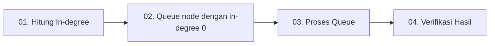

# 🤖 Kahn's Algorithm
## 📊 Algoritma Topological Sorting untuk Directed Acyclic Graph (DAG)

### 📚 Design and Analysis of Algorithms

## 📑 Daftar Isi

1. [🔍 Apa itu Algoritma Kahn?](#-apa-itu-algoritma-kahn)
2. [⏰ Kapan Algoritma Kahn Dibutuhkan?](#-kapan-algoritma-kahn-dibutuhkan)
3. [⚙️ Bagaimana Algoritma Kahn Bekerja?](#️-bagaimana-algoritma-kahn-bekerja)
4. [📚 Contoh Kasus 1: Dependensi Mata Kuliah](#-contoh-kasus-1-dependensi-mata-kuliah)
5. [💼 Contoh Kasus 2: Manajemen Proyek](#-contoh-kasus-2-manajemen-proyek)
6. [💻 Implementasi Kode](#-implementasi-kode)
7. [✅ Kelebihan](#-kelebihan)
8. [❌ Kekurangan](#-kekurangan)
9. [📌 Kesimpulan](#-kesimpulan)

---

## 🔍 Apa itu Algoritma Kahn?

**Kahn's Algorithm** adalah algoritma penyusunan topologi (*topological sorting*) yang digunakan untuk menentukan urutan dalam sebuah **Directed Acyclic Graph (DAG)** berdasarkan ketergantungan antar simpul.

### 🎯 Definisi Kunci

> 📍 **Algoritma Kahn** adalah pendekatan berbasis BFS untuk menemukan urutan node yang valid dalam Directed Acyclic Graph (DAG)

### 📐 Prinsip Dasar

**Urutan topologi DAG** adalah urutan dimana untuk setiap tepi yang diarahkan `u → v`, simpul `u` muncul sebelum `v` dalam urutan tersebut.

### 🌟 Karakteristik Utama

| 🔢 Aspek | 📝 Deskripsi |
|----------|--------------|
| **Basis Algoritma** | Breadth-First Search (BFS) |
| **Struktur Data** | Queue dan In-degree array |
| **Kompleksitas** | O(V + E) |
| **Tujuan** | Mengurutkan node berdasarkan dependensi |

---

## ⏰ Kapan Algoritma Kahn Dibutuhkan?

### 🎯 Tiga Penggunaan Utama

<div align="center">

| 🤖 **Menjadwal Tugas** | 💰 **Mendeteksi Siklus** | 📋 **Memproses Dependensi** |
|:---:|:---:|:---:|
| 📅 | 🔄 | ⚡ |
| Menjadwal tugas berdasarkan dependensi | Mendeteksi siklus dalam grafik terarah | Memproses dependensi dalam urutan yang benar |

</div>

### 🚀 Aplikasi Praktis

- 📚 **Sistem Pendidikan**: Penjadwalan mata kuliah dengan prasyarat
- 🏗️ **Manajemen Proyek**: Urutan pengerjaan tugas proyek
- 💻 **Kompilasi Program**: Urutan kompilasi file dengan dependensi
- 🎮 **Game Development**: Loading asset berdasarkan dependensi
- 📦 **Package Manager**: Instalasi paket dengan dependensi (npm, pip, etc.)

---

## ⚙️ Bagaimana Algoritma Kahn Bekerja?

### 🔄 Langkah-Langkah Algoritma



#### 📋 Detail Setiap Langkah

| 🔢 Step | 🎯 Aksi | 📝 Deskripsi |
|---------|---------|--------------|
| **01** | **Gunakan struktur in-degree** | Hitung jumlah sisi masuk untuk tiap simpul |
| **02** | **Inisialisasi Queue** | Tambahkan semua simpul dengan in-degree = 0 ke antrean |
| **03** | **Proses antrean** | Keluarkan node, kurangi in-degree tetangga, tambahkan yang jadi 0 |
| **04** | **Validasi hasil** | Jika semua simpul telah diproses, graf tidak memiliki siklus |

### 🎨 Visualisasi Proses

```
Initial State:
    A(0) → B(1) → D(2)
     ↓      ↓
    C(1) ← ┘

Step 1: Process A (in-degree = 0)
    Queue: [A]
    Result: [A]

Step 2: Reduce neighbors' in-degree
    B(0), C(0) → Add to queue
    Queue: [B, C]
    Result: [A]

Step 3: Process B, then C
    Queue: [D]
    Result: [A, B, C]

Step 4: Process D
    Queue: []
    Result: [A, B, C, D] ✓
```

---

## 📚 Contoh Kasus 1: Dependensi Mata Kuliah

### 📊 Skenario

Misalnya kita punya dependensi antar mata kuliah:

```
A → C (A adalah prasyarat untuk C)
B → C (B adalah prasyarat untuk C)
C → D (C adalah prasyarat untuk D)
```

### 🎯 Interpretasi

- 📘 **A dan B** harus diselesaikan sebelum mengambil **C**
- 📗 **C** harus diselesaikan sebelum mengambil **D**

### ✅ Urutan Topologis yang Valid

```
Opsi 1: A → B → C → D
Opsi 2: B → A → C → D
```

### 📊 Tabel In-degree

| 📚 Node | 📥 In-degree Awal | 🔄 Proses |
|---------|-------------------|-----------|
| A | 0 | ✅ Langsung masuk queue |
| B | 0 | ✅ Langsung masuk queue |
| C | 2 | ⏳ Tunggu A dan B selesai |
| D | 1 | ⏳ Tunggu C selesai |

---

## 💼 Contoh Kasus 2: Manajemen Proyek

### 🏗️ Skenario

Bayangkan kamu sedang mengelola proyek dengan 6 tugas (A sampai F), dan ada beberapa ketergantungan antar tugas:

```
A → D (A harus selesai sebelum D)
F → B (F harus selesai sebelum B)
B → D (B harus selesai sebelum D)
F → A (F harus selesai sebelum A)
D → C (D harus selesai sebelum C)
```

### 📋 Interpretasi Ketergantungan

| 🎯 Tugas | 📌 Dependensi | 📝 Keterangan |
|----------|---------------|---------------|
| **A** | F | Membutuhkan F selesai dulu |
| **B** | F | Membutuhkan F selesai dulu |
| **C** | D | Membutuhkan D selesai dulu |
| **D** | A, B | Membutuhkan A dan B selesai |
| **E** | - | Tidak ada dependensi (independen) |
| **F** | - | Tidak ada dependensi (independen) |

### ✅ Urutan Topologis yang Valid

```
Opsi 1: F → A → B → D → C → E
Opsi 2: F → B → A → D → C → E
Opsi 3: E → F → A → B → D → C
Opsi 4: E → F → B → A → D → C
```

💡 **Catatan**: E bisa dikerjakan kapan saja karena tidak memiliki dependensi!

---

## 💻 Implementasi Kode

### 🔧 C++ Implementation

```cpp
#include <iostream>
#include <unordered_map>
#include <vector>
#include <set>
#include <algorithm>
#include <queue>

using namespace std;

// Graph representation
unordered_map<char, vector<char>> graph;
unordered_map<char, int> in_degree;
set<char> vertices;

// Kahn's Algorithm implementation
void kahnsAlgorithm() {
    // Step 1: Initialize queue with nodes having in-degree 0
    queue<char> q;
    vector<char> topological_order;
    
    for (char vertex : vertices) {
        if (in_degree[vertex] == 0) {
            q.push(vertex);
        }
    }
    
    // Step 2: Process queue
    while (!q.empty()) {
        char current = q.front();
        q.pop();
        topological_order.push_back(current);
        
        // Reduce in-degree of neighbors
        for (char neighbor : graph[current]) {
            in_degree[neighbor]--;
            if (in_degree[neighbor] == 0) {
                q.push(neighbor);
            }
        }
    }
    
    // Step 3: Check for cycles
    if (topological_order.size() != vertices.size()) {
        cout << "❌ Graf mengandung siklus!" << endl;
    } else {
        cout << "✅ Urutan Topologis: ";
        for (char node : topological_order) {
            cout << node << " ";
        }
        cout << endl;
    }
}

int main() {
    int E;
    cout << "Masukkan jumlah edge (sisi): ";
    cin >> E;
    
    cout << "Masukkan sisi dalam format 'A B' (tanpa panah):" << endl;
    for (int i = 0; i < E; ++i) {
        char u, v;
        cin >> u >> v;
        graph[u].push_back(v);
        in_degree[v]++;
        vertices.insert(u);
        vertices.insert(v);
    }
    
    // Initialize in-degree for all vertices
    for (char v : vertices) {
        if (in_degree.find(v) == in_degree.end()) {
            in_degree[v] = 0;
        }
    }
    
    kahnsAlgorithm();
    
    return 0;
}
```

### 🐍 Python Implementation

```python
from collections import defaultdict, deque

class KahnsAlgorithm:
    def __init__(self):
        self.graph = defaultdict(list)
        self.in_degree = defaultdict(int)
        self.vertices = set()
    
    def add_edge(self, u, v):
        """Menambahkan edge dari u ke v"""
        self.graph[u].append(v)
        self.in_degree[v] += 1
        self.vertices.add(u)
        self.vertices.add(v)
    
    def topological_sort(self):
        """Implementasi Kahn's Algorithm"""
        # Step 1: Initialize queue dengan node in-degree 0
        queue = deque()
        result = []
        
        # Ensure all vertices have in_degree entry
        for vertex in self.vertices:
            if vertex not in self.in_degree:
                self.in_degree[vertex] = 0
            if self.in_degree[vertex] == 0:
                queue.append(vertex)
        
        # Step 2: Process queue
        while queue:
            current = queue.popleft()
            result.append(current)
            
            # Kurangi in-degree tetangga
            for neighbor in self.graph[current]:
                self.in_degree[neighbor] -= 1
                if self.in_degree[neighbor] == 0:
                    queue.append(neighbor)
        
        # Step 3: Cek siklus
        if len(result) != len(self.vertices):
            return None, "❌ Graf mengandung siklus!"
        
        return result, "✅ Urutan topologis berhasil ditemukan!"

# Contoh penggunaan
if __name__ == "__main__":
    kahn = KahnsAlgorithm()
    
    # Contoh: Dependensi mata kuliah
    edges = [
        ('A', 'C'),
        ('B', 'C'),
        ('C', 'D')
    ]
    
    print("📚 Contoh: Dependensi Mata Kuliah")
    print("Edges:", edges)
    
    for u, v in edges:
        kahn.add_edge(u, v)
    
    result, message = kahn.topological_sort()
    print(message)
    if result:
        print("Urutan:", ' → '.join(result))
    
    # Contoh: Project Management
    print("\n💼 Contoh: Project Management")
    kahn2 = KahnsAlgorithm()
    
    project_edges = [
        ('F', 'A'),
        ('F', 'B'),
        ('A', 'D'),
        ('B', 'D'),
        ('D', 'C')
    ]
    
    print("Edges:", project_edges)
    
    for u, v in project_edges:
        kahn2.add_edge(u, v)
    
    # Add isolated vertex E
    kahn2.vertices.add('E')
    
    result2, message2 = kahn2.topological_sort()
    print(message2)
    if result2:
        print("Urutan:", ' → '.join(result2))
```

---

## ✅ Kelebihan

### 🌟 Tiga Keunggulan Utama

<div align="center">

| 🚀 **Kompleksitas Waktu** | 🔍 **Deteksi Siklus** | 🎯 **Masalah Dependency** |
|:---:|:---:|:---:|
| ⚡ O(V + E) | 🔄 | 📊 |
| Sangat efisien untuk graf besar | Dapat mendeteksi siklus dalam graf berarah | Cocok untuk mata kuliah, build system, atau project tasks |

</div>

### 📊 Detail Kelebihan

| 🌟 Aspek | 📝 Penjelasan |
|----------|---------------|
| **🎯 Intuitif** | Mudah dipahami dan diimplementasikan |
| **⚡ Efisien** | Kompleksitas linear terhadap jumlah node dan edge |
| **🔍 Deteksi Siklus** | Otomatis mendeteksi jika graf mengandung siklus |
| **📊 Versatile** | Dapat digunakan untuk berbagai masalah dependensi |

---

## ❌ Kekurangan

### ⚠️ Tiga Keterbatasan Utama

<div align="center">

| 🔄 **Graf Siklus** | 🎲 **Output** | 💾 **Struktur Data** |
|:---:|:---:|:---:|
| ❌ | 🔀 | 📦 |
| Tidak bisa digunakan pada graf yang mengandung siklus | Bisa menghasilkan lebih dari satu urutan topologis yang valid | Memerlukan struktur data tambahan (in-degree dan graph) |

</div>

### 📊 Detail Kekurangan

| ⚠️ Aspek | 📝 Penjelasan |
|----------|---------------|
| **🚫 Keterbatasan DAG** | Hanya bekerja pada Directed Acyclic Graph |
| **🎲 Non-deterministic** | Urutan node dengan in-degree sama bisa bervariasi |
| **💾 Memory Overhead** | Membutuhkan space tambahan untuk menyimpan in-degree |
| **🔧 Setup Complexity** | Perlu preprocessing untuk menghitung in-degree |

---

## 📌 Kesimpulan

### 🎯 Poin-Poin Penting

**Kahn's Algorithm** merupakan metode yang **efisien dan sistematis** untuk melakukan topological sorting pada Directed Acyclic Graph (DAG). Dengan memanfaatkan struktur in-degree dan antrean, algoritma ini mampu:

1. 📊 **Menyusun simpul-simpul** berdasarkan ketergantungan yang ada
2. 🔍 **Mendeteksi keberadaan siklus** dalam graf
3. ⚡ **Bekerja dengan kompleksitas O(V + E)** yang sangat efisien

### 💡 Implementasi Praktis

Implementasinya dalam bahasa C++ dan Python memperlihatkan bagaimana struktur data seperti:
- 🗺️ `unordered_map` / `defaultdict`
- 📦 `queue` / `deque`
- 📋 `vector` / `list`

dapat digunakan untuk memodelkan graf dan proses penyusunannya secara elegan.

### 🚀 Aplikasi Nyata

Algoritma ini sangat berguna dalam berbagai aplikasi nyata:
- 📚 **Penjadwalan tugas akademik**
- 💻 **Kompilasi program**
- 🏗️ **Manajemen proyek**
- 📦 **Dependency resolution dalam package managers**
- 🎮 **Asset loading dalam game development**

### 🎓 Pesan Akhir

> 💭 "Kahn's Algorithm adalah solusi elegan untuk masalah yang kompleks. Dengan memahami konsep dasar dan implementasinya, kita dapat menyelesaikan berbagai masalah dependensi dengan efisien dan sistematis."

