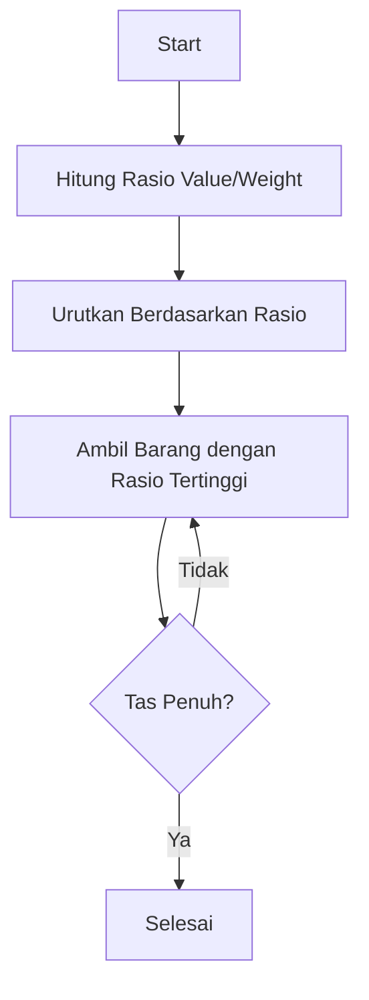

# 🎒 Fractional Knapsack
## 💰 Algoritma Optimasi dengan Pendekatan Greedy


## 📑 Daftar Isi

1. [🔍 Pengantar Knapsack Problem](#-pengantar-knapsack-problem)
2. [📌 Definisi Fractional Knapsack](#-definisi-fractional-knapsack)
3. [🎯 Karakteristik](#-karakteristik)
4. [⚡ Strategi Penyelesaian](#-strategi-penyelesaian)
5. [⏱️ Kompleksitas Waktu](#️-kompleksitas-waktu)
6. [🌐 Aplikasi](#-aplikasi)
7. [🧠 Algoritma Greedy](#-algoritma-greedy)
8. [📊 Contoh Permasalahan](#-contoh-permasalahan)
9. [💻 Implementasi Kode](#-implementasi-kode)
10. [📌 Kesimpulan](#-kesimpulan)

---

## 🔍 Pengantar Knapsack Problem

**Knapsack Problem** adalah sebuah masalah optimasi di mana kita harus memilih barang-barang dari sekumpulan item agar nilai totalnya maksimal tanpa melebihi kapasitas berat ransel yang tersedia.

### 🎯 Dua Variasi Utama

<div align="center">

| 🔢 **0/1 Knapsack** | ⚖️ **Fractional Knapsack** |
|:---:|:---:|
| ❌ Barang tidak bisa dipotong | ✅ Barang bisa dipotong |
| 🎲 Ambil seluruhnya atau tidak sama sekali | ✂️ Bisa ambil sebagian |
| 💻 Diselesaikan dengan Dynamic Programming | 🚀 Diselesaikan dengan Greedy Algorithm |
| 🧮 Lebih kompleks | ⚡ Lebih sederhana dan efisien |

</div>

### 🎨 Ilustrasi Perbedaan

```
0/1 Knapsack:     [■■■■] → Ambil semua atau tidak
Fractional:       [■■□□] → Bisa ambil sebagian
```

---

## 📌 Definisi Fractional Knapsack

> 💡 **Fractional Knapsack** adalah sebuah permasalahan optimisasi dalam bidang algoritma dan struktur data, di mana tujuannya adalah untuk memaksimalkan nilai total barang yang dimasukkan ke dalam sebuah knapsack (tas) dengan kapasitas tertentu, dengan kemungkinan mengambil sebagian (fraksi) dari barang.

### 🎯 Konsep Kunci

- 📦 **Barang dapat dipecah** menjadi bagian-bagian yang lebih kecil
- 💰 **Tujuan**: Maksimalkan nilai total dalam tas
- ⚖️ **Batasan**: Kapasitas tas yang terbatas
- 🔪 **Fleksibilitas**: Boleh mengambil fraksi dari setiap barang

---

## 🎯 Karakteristik

### 📋 Karakteristik Utama Fractional Knapsack

| 🔑 Aspek | 📝 Deskripsi |
|----------|--------------|
| **📊 Atribut Barang** | Setiap barang memiliki berat (weight) dan nilai (value) |
| **🎒 Kapasitas** | Tas memiliki kapasitas terbatas |
| **✂️ Pembagian** | Barang boleh dipotong atau diambil sebagian (misal: 0.5 bagian) |
| **🚀 Solusi** | Dapat diselesaikan dengan greedy algorithm |
| **🎯 Optimal** | Selalu menghasilkan solusi optimal |

### 🌟 Keunggulan

- ✅ **Efisien**: Kompleksitas waktu yang rendah
- ✅ **Optimal**: Selalu menghasilkan nilai maksimal
- ✅ **Sederhana**: Mudah dipahami dan diimplementasikan
- ✅ **Fleksibel**: Dapat mengambil sebagian barang

---

## ⚡ Strategi Penyelesaian

### 🧠 Pendekatan Greedy Algorithm



### 📋 Langkah-Langkah Detail

| 🔢 Step | 🎯 Aksi | 📝 Deskripsi |
|---------|---------|--------------|
| **1️⃣** | **Hitung Rasio** | Hitung value/weight untuk setiap item |
| **2️⃣** | **Urutkan** | Urutkan item berdasarkan rasio secara menurun |
| **3️⃣** | **Ambil Item** | Ambil sebanyak mungkin dari item dengan rasio tertinggi |
| **4️⃣** | **Cek Kapasitas** | Jika tidak bisa ambil penuh, ambil sebagian |
| **5️⃣** | **Iterasi** | Lanjut ke item berikutnya hingga tas penuh |

### 🎨 Visualisasi Proses

```
Rasio:    [5.0] [3.5] [3.0] [2.0]
Priority:  1st   2nd   3rd   4th
Ambil:    [■■■] [■■■] [■□□] [---]
          100%  100%  50%   0%
```

---

## ⏱️ Kompleksitas Waktu

### 📊 Analisis Kompleksitas

| 🎯 Operasi | ⏰ Kompleksitas | 📝 Keterangan |
|------------|-----------------|---------------|
| **Sorting** | O(n log n) | Mengurutkan item berdasarkan rasio |
| **Iterasi** | O(n) | Memasukkan item ke dalam tas |
| **Total** | **O(n log n)** | Didominasi oleh proses sorting |

### 💡 Perbandingan dengan 0/1 Knapsack

```
Fractional: O(n log n) ⚡ Cepat
0/1 Knapsack: O(nW) 🐌 Lebih lambat
```

---

## 🌐 Aplikasi

### 🚀 Aplikasi Nyata Fractional Knapsack

<div align="center">

| 📅 **Penjadwalan Tugas** | 💸 **Investasi Dana** |
|:---:|:---:|
| Alokasi waktu untuk berbagai tugas dengan prioritas berbeda | Distribusi dana ke berbagai proyek investasi |
| 🌐 **Bandwidth Jaringan** | 🚚 **Optimisasi Logistik** |
| Pembagian bandwidth untuk berbagai aplikasi | Pengaturan muatan kendaraan pengiriman |

</div>

### 📋 Detail Aplikasi

1. **📅 Penjadwalan Tugas**
   - Mengalokasikan sumber daya terbatas
   - Memaksimalkan produktivitas
   - Memprioritaskan tugas penting

2. **💸 Investasi Dana**
   - Portfolio management
   - Risk-return optimization
   - Asset allocation

3. **🌐 Pengalokasian Bandwidth**
   - Quality of Service (QoS)
   - Network traffic management
   - Resource optimization

4. **🚚 Optimisasi Logistik**
   - Container loading
   - Route optimization
   - Warehouse management

---

## 🧠 Algoritma Greedy

### 📚 Definisi

> 🎯 **Algoritma Greedy** adalah sebuah pendekatan atau strategi dalam merancang algoritma yang membuat pilihan yang tampak terbaik pada saat itu (pilihan optimal lokal) dengan harapan bahwa pilihan tersebut akan mengarah pada solusi optimal global.

### 🔑 Karakteristik Utama

<div align="center">

| 🎯 **Pilihan Lokal Optimal** | 👁️ **Tidak Melihat ke Depan** | ⚡ **Sederhana dan Cepat** |
|:---:|:---:|:---:|
| Di setiap langkah, algoritma memilih opsi yang paling menguntungkan saat itu | Keputusan dibuat berdasarkan informasi saat ini saja | Implementasi sederhana dengan kompleksitas rendah |

</div>

### ✅ Kelebihan vs ❌ Kekurangan

| ✅ **Kelebihan** | ❌ **Kekurangan** |
|------------------|-------------------|
| 🚀 Sangat efektif untuk masalah tertentu | ⚠️ Tidak selalu menghasilkan solusi optimal global |
| ⚡ Waktu eksekusi cepat | 🎲 Hanya optimal untuk masalah tertentu |
| 💡 Mudah dipahami dan diimplementasikan | 🔍 Tidak bisa backtrack jika salah pilih |
| 📊 Cocok untuk Fractional Knapsack | ❌ Tidak cocok untuk 0/1 Knapsack |

---

## 📊 Contoh Permasalahan

### 🎯 Permasalahan 1: Item Dasar

#### 📋 Data Item

| 📦 Item | 💰 Nilai | ⚖️ Berat | 📊 Rasio |
|---------|----------|----------|----------|
| A | 50 | 10 | 5.0 |
| B | 60 | 20 | 3.0 |
| C | 140 | 40 | 3.5 |
| D | 60 | 30 | 2.0 |

**🎒 Kapasitas Tas**: 50 kg

#### 🧮 Solusi

1. **Urutkan**: A (5.0) → C (3.5) → B (3.0) → D (2.0)
2. **Ambil**:
   - ✅ A: 10 kg, nilai 50
   - ✅ C: 40 kg, nilai 140
   - ❌ B dan D tidak diambil (tas penuh)
3. **Total**: 190 💰

---

### 🏕️ Permasalahan 2: Pendaki Gunung

#### 📋 Barang Pendakian

| 🎒 Barang | ⚖️ Berat | 💰 Nilai | 📊 Rasio |
|-----------|----------|----------|----------|
| 🍔 Makanan | 10 kg | 60 | 6.0 |
| 🥾 Selimut | 20 kg | 100 | 5.0 |
| 📷 Kamera | 30 kg | 120 | 4.0 |

**🎒 Kapasitas**: 50 kg

#### 🧮 Solusi
- ✅ Makanan: 10 kg → Nilai = 60
- ✅ Selimut: 20 kg → Nilai = 100
- ✂️ Kamera: 20 kg (2/3 bagian) → Nilai = 80
- **Total**: 240 💰

---

### ♻️ Permasalahan 3: Pemulung Logam

#### 📋 Logam Bekas

| 🔧 Logam | ⚖️ Berat | 💰 Nilai | 📊 Rasio |
|----------|----------|----------|----------|
| 🟤 Tembaga | 5 kg | 100 | 20.0 |
| ⚪ Aluminium | 10 kg | 60 | 6.0 |
| ⚫ Besi | 20 kg | 80 | 4.0 |

**🎒 Kapasitas**: 15 kg

#### 🧮 Solusi
- ✅ Tembaga: 5 kg → Nilai = 100
- ✅ Aluminium: 10 kg → Nilai = 60
- ❌ Besi: Tidak diambil
- **Total**: 160 💰

---

### 🎓 Permasalahan 4: Mahasiswa Pindahan

#### 📋 Barang Prioritas

| 📚 Barang | ⚖️ Berat | 💰 Nilai Penting | 📊 Rasio |
|-----------|----------|------------------|----------|
| 💻 Laptop | 10 kg | 300 | 30.0 |
| 📚 Buku Paket | 20 kg | 200 | 10.0 |
| 👕 Baju | 30 kg | 180 | 6.0 |

**🎒 Kapasitas**: 30 kg

#### 🧮 Solusi
- ✅ Laptop: 10 kg → Nilai = 300
- ✅ Buku: 20 kg → Nilai = 200
- ❌ Baju: Tidak bisa diambil
- **Total**: 500 💰

---

## 💻 Implementasi Kode

### 🔧 C++ Implementation

```cpp
#include <iostream>
#include <vector>
#include <algorithm>
using namespace std;

// Struktur untuk menyimpan data item
struct Item {
    string name;
    double weight;
    double value;
    double ratio;
};

// Fungsi comparator untuk mengurutkan berdasarkan rasio
bool compare(Item a, Item b) {
    return a.ratio > b.ratio;
}

// Fungsi utama Fractional Knapsack
double fractionalKnapsack(double capacity, vector<Item>& items) {
    // Hitung rasio dan urutkan
    for (auto& item : items) {
        item.ratio = item.value / item.weight;
    }
    sort(items.begin(), items.end(), compare);
    
    double totalValue = 0.0;
    double totalWeight = 0.0;
    
    cout << "\n📦 Barang yang dipilih:\n";
    cout << "========================\n";
    
    for (const auto& item : items) {
        if (capacity == 0) break;
        
        if (item.weight <= capacity) {
            // Ambil seluruh barang
            totalValue += item.value;
            capacity -= item.weight;
            cout << "✅ " << item.name << " (Berat: " << item.weight 
                 << " kg, Nilai: " << item.value << ")\n";
        } else {
            // Ambil sebagian barang (fractional)
            double fraction = capacity / item.weight;
            totalValue += item.value * fraction;
            cout << "✂️ " << item.name << " (Berat: " << capacity 
                 << " kg dari " << item.weight << " kg, Nilai: " 
                 << item.value * fraction << ")\n";
            capacity = 0;
        }
    }
    
    return totalValue;
}

int main() {
    double capacity = 30.0;
    vector<Item> items = {
        {"Laptop", 10, 300},
        {"Buku Paket", 20, 200},
        {"Baju", 30, 180}
    };
    
    cout << "🎒 FRACTIONAL KNAPSACK PROBLEM\n";
    cout << "==============================\n";
    cout << "Kapasitas maksimal: " << capacity << " kg\n";
    
    double maxValue = fractionalKnapsack(capacity, items);
    
    cout << "\n💰 Total nilai maksimum: " << maxValue << endl;
    
    return 0;
}
```

### 🐍 Python Implementation

```python
class Item:
    def __init__(self, name, weight, value):
        self.name = name
        self.weight = weight
        self.value = value
        self.ratio = value / weight

def fractional_knapsack(capacity, items):
    """
    Implementasi Fractional Knapsack dengan Greedy Algorithm
    """
    # Urutkan berdasarkan rasio value/weight
    items.sort(key=lambda x: x.ratio, reverse=True)
    
    total_value = 0
    current_weight = 0
    selected_items = []
    
    print("\n📦 Proses Pemilihan Barang:")
    print("=" * 50)
    
    for item in items:
        if current_weight + item.weight <= capacity:
            # Ambil seluruh barang
            current_weight += item.weight
            total_value += item.value
            selected_items.append((item.name, item.weight, item.value, 1.0))
            print(f"✅ {item.name}: {item.weight} kg → Nilai = {item.value}")
        else:
            # Ambil sebagian barang
            remaining_capacity = capacity - current_weight
            if remaining_capacity > 0:
                fraction = remaining_capacity / item.weight
                current_weight += remaining_capacity
                partial_value = item.value * fraction
                total_value += partial_value
                selected_items.append((item.name, remaining_capacity, partial_value, fraction))
                print(f"✂️  {item.name}: {remaining_capacity:.1f} kg dari {item.weight} kg → Nilai = {partial_value:.1f}")
            break
    
    return total_value, selected_items

# Contoh penggunaan
if __name__ == "__main__":
    # Permasalahan 4: Mahasiswa Pindahan
    items = [
        Item("Laptop", 10, 300),
        Item("Buku Paket", 20, 200),
        Item("Baju", 30, 180)
    ]
    
    capacity = 30
    
    print("🎒 FRACTIONAL KNAPSACK - MAHASISWA PINDAHAN")
    print("=" * 50)
    print(f"Kapasitas tas: {capacity} kg")
    print("\n📋 Daftar Barang:")
    for item in items:
        print(f"   • {item.name}: {item.weight} kg, Nilai: {item.value}, Rasio: {item.ratio:.1f}")
    
    max_value, selected = fractional_knapsack(capacity, items)
    
    print(f"\n💰 Total Nilai Maksimum: {max_value}")
    print("\n✨ Ringkasan:")
    for name, weight, value, fraction in selected:
        if fraction == 1.0:
            print(f"   • {name}: Diambil semua ({weight} kg)")
        else:
            print(f"   • {name}: Diambil {fraction*100:.0f}% ({weight:.1f} kg)")
```

### 🎯 Output Expected

```
🎒 FRACTIONAL KNAPSACK - MAHASISWA PINDAHAN
==================================================
Kapasitas tas: 30 kg

📋 Daftar Barang:
   • Laptop: 10 kg, Nilai: 300, Rasio: 30.0
   • Buku Paket: 20 kg, Nilai: 200, Rasio: 10.0
   • Baju: 30 kg, Nilai: 180, Rasio: 6.0

📦 Proses Pemilihan Barang:
==================================================
✅ Laptop: 10 kg → Nilai = 300
✅ Buku Paket: 20 kg → Nilai = 200

💰 Total Nilai Maksimum: 500

✨ Ringkasan:
   • Laptop: Diambil semua (10 kg)
   • Buku Paket: Diambil semua (20 kg)
```

---

## 📌 Kesimpulan

### 🎯 Poin-Poin Penting

**Fractional Knapsack** adalah salah satu variasi dari Knapsack Problem yang dapat diselesaikan secara efisien menggunakan **algoritma greedy**. Karakteristik utamanya:

1. **✂️ Fleksibilitas**: Barang boleh diambil sebagian (fraksional)
2. **🚀 Efisiensi**: Kompleksitas O(n log n) yang optimal
3. **🎯 Optimal**: Selalu menghasilkan solusi maksimal
4. **💡 Sederhana**: Mudah dipahami dan diimplementasikan

### 🔑 Strategi Kunci

> 📊 Dengan menghitung rasio nilai terhadap berat (value/weight) untuk setiap barang, lalu mengambil barang dengan rasio tertinggi hingga kapasitas tas penuh, kita bisa mendapatkan solusi optimal secara cepat dan sederhana.

### 💭 Mengapa Greedy Bekerja?

Pendekatan greedy ini bekerja efektif karena:
- ✅ Pilihan optimal lokal (berdasarkan rasio) 
- ✅ Mengarah pada solusi optimal global
- ✅ Tidak ada konflik antar keputusan
- ✅ Dapat mengambil fraksi barang

### 🚀 Aplikasi Praktis

Fractional Knapsack sangat berguna dalam:
- 💼 Resource allocation
- 📊 Portfolio optimization
- 🌐 Network bandwidth management
- 🚚 Logistics and transportation

